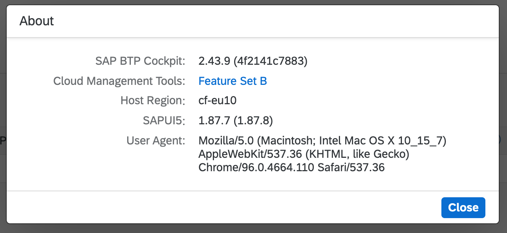
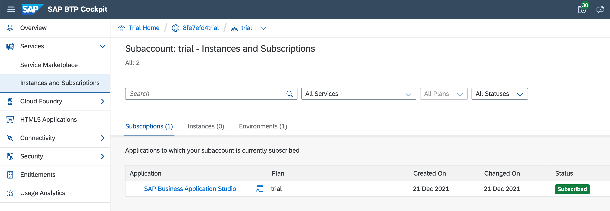
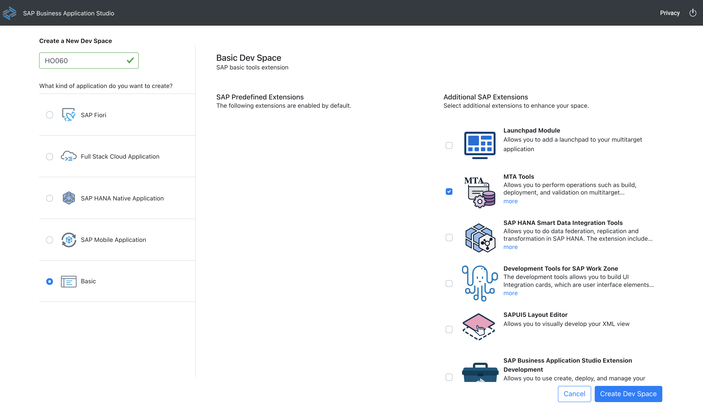

# Hands-on with the btp CLI and APIs

## Description

This repository contains the material for the "Hands-on with the btp CLI and APIs" CodeJam, a CodeJam within the [SAP CodeJam BTP group](https://groups.community.sap.com/t5/sap-codejam-btp/gh-p/codejam-btp).

## Overview

This CodeJam introduces attendees to `btp`, the CLI for the SAP Business Technology Platform (SAP BTP). Here's the description of the btp CLI from the official download page: "_Use the btp CLI for account administration on SAP BTP. The btp CLI is only available for global accounts on feature set B (for example, SAP BTP Trial accounts)_".

It also introduces attendees to the APIs for SAP BTP, the Core Services for SAP BTP, which, [according to the SAP API Business Hub](https://api.sap.com/package/SAPCloudPlatformCoreServices/rest), allow you to "manage, build, and extend the core capabilities of SAP BTP."

## About this CodeJam

During this CodeJam, you'll learn how to harness the power of the btp CLI, as well as the core service APIs, to report on and manage resources on SAP BTP.

In the first part, you'll follow along with the session speaker installing, configuring & setting up the btp CLI, and authenticating with a BTP account. You'll then explore the btp CLI features and command structure, plus alternative output formats, autocompletion and more. Then you'll get comfortable navigating and creating resources within your BTP global account.

In the second part, you'll learn how to incorporate the btp CLI into shell scripts, so you can write custom utilities that suit your specific needs.

## Session prerequisites

In order to get the most from this CodeJam, and to be able to work through the exercises, you must have the following prerequisites set up before the day of the CodeJam.

### BTP trial account

You must have a fresh or relatively recent, and active (unexpired) trial account on the SAP Business Technology Platform. It's important that your trial account has [Feature Set B](https://help.sap.com/products/BTP/65de2977205c403bbc107264b8eccf4b/caf4e4e23aef4666ad8f125af393dfb2.html) Cloud Management Tools. You can check this from the BTP Cockpit using the "About" option which will show something like this:

If you don't have a trial account right now, you can get one by following the instructions in this tutorial: [Get an SAP BTP Account for Tutorials](https://developers.sap.com/tutorials/btp-cockpit-setup.html). While Free Tier is generally gradually replacing Trial, this content was written based on Trial. Moreover, Free Tier is not yet available in all regions and it's important that all participants have the same setup for this hands-on session.

### A subscription to SAP Business Application Studio

Your trial account should have a subscription set up to the SAP Business Application Studio (App Studio). If you've created your trial account recently, this subscription may already be set up for you. Otherwise, use the BTP Cockpit to find the entry in the Service Marketplace and create a subscription manually, with the "trial" plan. You should end up with something that looks like this:

### A Basic Dev Space set up

Within the App Studio you should set up a "Basic" Dev Space ready for this hands-on session. Make sure you also select the "MTA Tools" in the "Additional SAP Extensions" list (this will give you the `cf` command line tool, amongst other things). Give the Dev Space a name, and hit "Create Dev Space".

### Knowledge and experience

From a knowledge and experience perspective, the following is useful but not essential:

* Some general experience of working on the command line, or at least an appetite for it
* A general idea of the structure of BTP resources such as subaccounts, directories, entitlements, regions and environments
* An awareness of shell scripting, using the Bash shell in particular

### Docker Desktop

The last exercise listed, called "BTP tools in containers", is a bonus exercise; whether we get to it depends on how we get through the other exercises. It may just be presented as a demo, but you can also work through it on your own after the CodeJam has finished. If you want to be able to work through this bonus exercise, you will need Docker Desktop installed on your machine.

> The license for Docker Desktop has changed - see [Docker is Updating and Extending Our Product Subscriptions](https://www.docker.com/blog/updating-product-subscriptions/) for an overview.

## Exercises

These are the exercises, each in their own directory, sometimes with supporting files and scripts. We will work through the exercises in the order shown here. From a session flow perspective, we are taking the "coordinated" approach:

The instructor will set you off on the first exercise, and that's the only one you should do; if you finish before others, there are some questions at the end of the exercise for you to ponder. Do not proceed to the next exercise until the instructor tells you to do so.

> The exercises are written in a conversational way; this is so that they have enough context and information to be completed outside the hands-on session itself. To help you navigate and find what you have to actually do next, there are pointers like this 👉 throughout that indicate the things you have to actually do (as opposed to just read for background information).

1. [Installing the btp CLI](exercises/01-installing/README.md)
1. [Authenticating and managing configuration](exercises/02-authenticating-and-configuration/README.md)
1. [Setting up autocomplete and initial account exploration](exercises/03-autocomplete-and-exploration/README.md)
1. [JSON output format and APIs](exercises/04-json-format-and-apis/README.md)
1. [BTP GUIDs and the btp CLI in practice](exercises/05-btp-guids-cli-in-practice/README.md)
1. [Writing your first script](exercises/06-writing-your-first-script/README.md)
1. [BTP tools in containers](exercises/07-btp-tools-in-containers/README.md)

## Feedback

If you can spare a couple of minutes at the end of the session, please help me improve for next time by giving me some feedback.

Simply use this [Give Feedback](https://github.com/SAP-samples/cloud-btp-cli-codejam/issues/new?assignees=&labels=feedback&template=feedback-template.md&title=Feedback) link to create a special "feedback" issue, and follow the instructions in there.

Thank you!

## How to obtain support

Support for the content in this repository is available during the actual time of the CodeJam event for which this content has been designed.

## Further connections and information

Here are a few pointers to resources for further connections and information on the btp CLI:

* there's a wealth of information on the SAP Help Portal in the [Account Administration Using the SAP BTP Command Line Interface (btp CLI) [Feature Set B]](https://help.sap.com/products/BTP/65de2977205c403bbc107264b8eccf4b/7c6df2db6332419ea7a862191525377c.html?locale=en-US&version=Cloud) topic
* you can find the friendly & welcoming team behind the btp CLI on the [#cli-dev](https://sap-btp.slack.com/archives/CCXF812E9) channel in Slack
* there's a [FAQ and information about support for the btp CLI](https://wiki.wdf.sap.corp/wiki/display/CPCLI/Support) on the wiki
* the playlist [The SAP btp CLI](https://www.youtube.com/playlist?list=PL6RpkC85SLQDXx827kdjKc6HRvdMRZ8P5) on the SAP Developers YouTube channel contains recordings of past live streams on the topic
* there's a [branch in the SAP Tech Bytes repo](https://github.com/SAP-samples/sap-tech-bytes/tree/2021-09-01-btp-cli) covering some basic aspects of the btp CLI

## License

Copyright (c) 2022 SAP SE or an SAP affiliate company. All rights reserved. This project is licensed under the Apache Software License, version 2.0 except as noted otherwise in the [LICENSE](LICENSES/Apache-2.0.txt) file.
