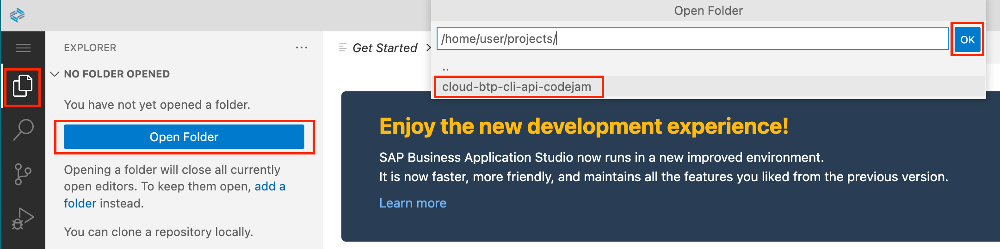

# Exercise 01 - Installing the btp CLI

At the end of this exercise, you'll have a comfortable command line environment within which to work, and the btp CLI installed and ready to invoke.

## Set up your working environment

Your activities in this CodeJam will be predominantly on the command line. And the key to a successful and enjoyable CodeJam include a working environment that is consistent for everyone.

To enable this, we use the SAP Business Application Studio (App Studio), a cloud based interactive development environment (IDE) that, amongst many other features, gives us all a command line based on the Bash shell, in a UNIX (Linux) environment - by far the most widely used in today's era of cloud native.

### Why a Dev Space in App Studio?

Why a Dev Space in App Studio, and why a Basic one at that? Well, because it allows everyone to have the same environment, so we can all learn at the same pace and experience the same things. Moreover, App Studio Dev Spaces offer a VS Code like experience (in fact, as of November 2022 it's now powered by [Code OSS](https://github.com/microsoft/vscode) with a file explorer, version control interface, comfortable tabbed editor environment, and - most importantly for us - a modern terminal emulator.

The power of the btp CLI comes from multiple angles:

* it gives us comfortable and convenient access to the [BTP APIs](https://api.sap.com/package/SAPCloudPlatformCoreServices/rest)
* it is a command line tool, meaning it lets us stay within our development flow and can be combined with other developer and devops tools
* it is scriptable - we can make use of the btp CLI within shell scripts to create whatever automation we need relating to management of resources on BTP

App Studio Dev Spaces, even Basic ones, give us that essential command line context. So that's what we're using. By all means, after this session, feel free to install and use the btp CLI where it makes sense for you.

> As a general rule, we'll get you to run commands in the terminal, at the shell prompt. Also as a general rule, we'll try to provide commands that will work from wherever you are in the directory hierarchy (by prefixing the path to the commands with `$HOME/` and going from there.

### Cloning the repository 

For this workshop we'll clone this repository into the Dev Space and use a script included in the repository to set the btp CLI up.

Initially the Dev Space will look something like this:


This is lovely, but we want to focus on the command line, so let's bring one up now.

👉 Do the following:

* close the Get Started tab with the `x` (optionally having checked the "Don't show this page again" checkbox at the bottom)
* open up a terminal session with menu path `Terminal -> New Terminal`
* optionally, open the Settings with menu path `File -> Preferences -> Settings`, find the font size setting for the terminal ("Terminal › Integrated: Font Size"), within Features / Terminal, and adjust as appropriate; close the Settings tab when you're done with this

You should end up with a shell prompt like this:


> Notice that in the menu items you're shown keyboard shortcuts for some of the actions you're carrying out (e.g. opening a new terminal, or opening the preferences) - these can make the use of the Dev Space even more comfortable.

Now we're ready to clone this repository. Note that this mini workshop content is not in the repository's main branch, so you need to specify the branch name explicitly (this is partly why we're doing this on the command line and not with the "Clone from Git" facility):

👉 At the shell prompt, move into the `projects/` directory and clone this `mini-workshop` branch of the repository like this:

```bash
cd $HOME/projects/
git clone -b mini-workshop https://github.com/SAP-samples/cloud-btp-cli-api-codejam
```

This is the sort of output that you should see as a result of this:

```text
user: user $ cd $HOME/projects/
user: projects $ git clone -b mini-workshop https://github.com/SAP-samples/cloud-btp-cli-api-codejam
Cloning into 'cloud-btp-cli-api-codejam'...
remote: Enumerating objects: 997, done.
remote: Counting objects: 100% (392/392), done.
remote: Compressing objects: 100% (211/211), done.
remote: Total 997 (delta 193), reused 336 (delta 163), pack-reused 605
Receiving objects: 100% (997/997), 9.04 MiB | 50.86 MiB/s, done.
Resolving deltas: 100% (556/556), done.
```

Now that you have the repository contents in your Dev Space, you might as well open those contents up in the Explorer, for easy navigation and, well, exploration.

👉 Open the Explorer perspective, use the Open Folder facility and navigate down to, and select, the `cloud-btp-cli-api-codejam` directory, i.e. this:

```text
/home/user/projects/cloud-btp-cli-api-codejam/
```



Doing this will cause the Dev Space to be restarted, and the contents of this branch of the repository to be presented in the Explorer. Feel free to take a quick look around if you want to.

### Setting up the btp CLI

To save time (this is covered in more detail in the [main branch version of this exercise](https://github.com/SAP-samples/cloud-btp-cli-api-codejam/blob/main/exercises/01-installing/README.md)) there's a [setup script](../../scripts/setup) that you can run to install the btp CLI into your Dev Space. 

👉 Run the script now, which will create a local `bin/` directory, and then download and run a small script that will in turn download the latest version of the btp CLI, putting it into that `bin/` directory.

```bash
$HOME/projects/cloud-btp-cli-api-codejam/scripts/setup
```

You should see output similar to this:

```text
  % Total    % Received % Xferd  Average Speed   Time    Time     Time  Current
                                 Dload  Upload   Total   Spent    Left  Speed
100  3766  100  3766    0     0   175k      0 --:--:-- --:--:-- --:--:--  175k
Proceed (with Enter) only if you accept the SAP Developer Licence 3.1
(see https://tools.hana.ondemand.com/developer-license-3_1.txt) ...Version is 2.29.0
```

The script will also add the local `bin/` directory to your PATH but you'll need to restart the terminal (getting a new shell session) to have that take effect. 

👉 So do that now. Close the current shell session with either `exit`, or pressing `Ctrl-D`. Then start a new terminal like you did before with menu path `Terminal -> New Terminal`.

### Make a first call to the btp CLI

Now you can invoke `btp` 

> This is because it's in `$HOME/bin/` which is now in your PATH.

👉 Try it now:

```text
user: user $ btp
Welcome to the SAP BTP command line interface (client v2.29.0)

Usage: btp [OPTIONS] ACTION [GROUP/OBJECT] [PARAMS]

CLI server URL:                    not set
User:                              not set
Configuration:                     /home/user/.config/.btp/config.json

You are currently not logged in.

Tips:
    To log in to a global account of SAP BTP, use 'btp login'. For help on login, use 'btp help login'.
    To display general help, use 'btp help'.

OK
```

👉 While you're here, take a few moments to stare at this line, to get a feel for btp CLI invocations on the command line:

```text
Usage: btp [OPTIONS] ACTION [GROUP/OBJECT] [PARAMS]
```

You'll find that it helps to remember this invocation format, by considering that -- usually -- the GROUP is plural, and the OBJECT is singular. For example, in the next exercise, you'll use `btp list accounts/subaccount`.

There's an SAP Help topic page linked in the [Further reading](#further-reading) section that explains how this is structured.

### Switch back to your home directory

This step is not absolutely necessary but it's helpful for us all to be on the same page, or rather in the same directory, as it were. 

So as a final step in this first exercise, switch to your home directory:

```bash
cd $HOME
```

> This is rather explicit; a simple `cd` would have done the trick too, of course.

## Summary

At this point you have the btp CLI set up and ready to invoke from the command line.

## Further reading

* [SAP Tech Bytes: btp CLI – installation](https://blogs.sap.com/2021/09/01/sap-tech-bytes-btp-cli-installation/)
* SAP Help topic [Command Syntax of the btp CLI](https://help.sap.com/products/BTP/65de2977205c403bbc107264b8eccf4b/69606f42743f46c29fa72c04e8c18674.html)

---

## Questions

If you finish earlier than your fellow participants, you might like to ponder these questions. There isn't always a single correct answer and there are no prizes - they're just to give you something else to think about.

1. What help is available for the btp CLI on the command line? What does `btp help` show you?
1. Why are there two entries in `$HOME/bin/` for the `btp` executable?
