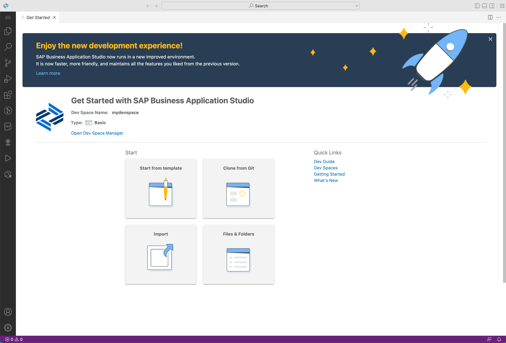
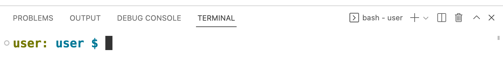
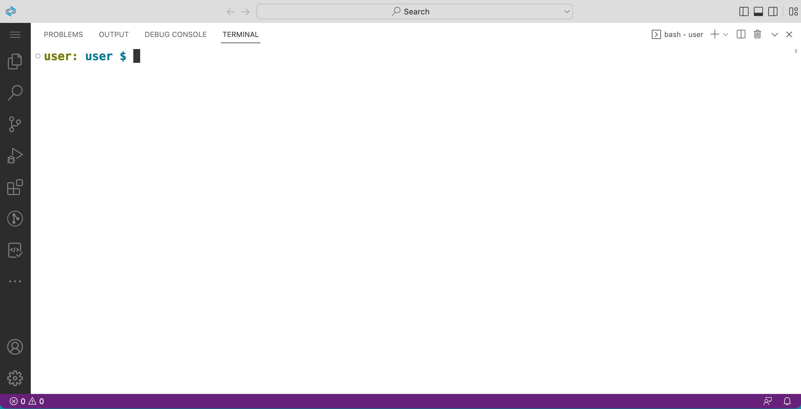

# Exercise 01 - Installing the btp CLI

At the end of this exercise, you'll have a comfortable command line environment within which to work, and the btp CLI installed and ready to invoke.

## Set up your working environment

Your activities in this CodeJam will be predominantly on the command line. And the key to a successful and enjoyable CodeJam include a working environment that is consistent for everyone.

To enable this, we use the SAP Business Application Studio (App Studio), a cloud based interactive development environment (IDE) that, amongst many other features, gives us all a command line based on the Bash shell, in a UNIX (Linux) environment - by far the most widely used in today's era of cloud native.

🐳 As an experimental alternative to this, we have a [container based approach](../../container/) that - if you're brave and willing to try it out - you can use instead. It assumes you have Docker Desktop installed, as described in the [Docker Desktop section of the Prerequisites document](../../prerequisites.md#docker-desktop-optional). So if you want to use a container for this CodeJam, jump over to the [container directory](../../container/) and follow the instructions to get set up. And then come back here, and jump forward to the [Install the btp CLI](#install-the-btp-cli) section below.

### Why a Dev Space in App Studio?

Why a Dev Space in App Studio, and why a Basic one at that? Well, because it allows everyone to have the same environment, so we can all learn at the same pace and experience the same things. Moreover, App Studio Dev Spaces offer a VS Code like experience (in fact, as of November 2022 it's now powered by [Code OSS](https://github.com/microsoft/vscode) with a file explorer, version control interface, comfortable tabbed editor environment, and - most importantly for us - a modern terminal emulator.

The power of the btp CLI comes from multiple angles:

* it gives us comfortable and convenient access to the [BTP APIs](https://api.sap.com/package/SAPCloudPlatformCoreServices/rest)
* it is a command line tool, meaning it lets us stay within our development flow and can be combined with other developer and devops tools
* it is scriptable - we can make use of the btp CLI within shell scripts to create whatever automation we need relating to management of resources on BTP

App Studio Dev Spaces, even Basic ones, give us that essential command line context. So that's what we're using. By all means, after this session, feel free to install and use the btp CLI where it makes sense for you.

### Clearing the Dev Space ready for work

Initially the Dev Space will look something like this:



This is lovely, but we want to focus on the command line, so let's remove everything to make as much space as possible for that command line.

> You can access all the menu commands via the `☰` symbol in the top left.

👉 Do the following:

* close the Get Started tab with the `x` (optionally having checked the "Don't show this page again" checkbox at the bottom)
* ensure the Explorer is closed (on startup it is likely already closed, but if it isn't, you can close it either by using "Toggle Primary Side Bar" which is the first of the four icons in the very top right of the Dev Space, or use the "Explorer" button which is the first one depicting two documents directly below the `☰` symbol in the black column on the far left)
* open up a terminal session with menu path `Terminal -> New Terminal`
* optionally, open the Settings with menu path `File -> Preferences -> Settings`, find the font size setting for the terminal ("Terminal › Integrated: Font Size"), within Features / Terminal, and adjust as appropriate; close the Settings tab when you're done with this
* drag the horizontal line up towards the top of the screen to give you maximum terminal space, or use the Maximize Panel Size button (the `^` symbol) on right of the terminal shown in the screenshot below



> Notice that in the menu items you're shown keyboard shortcuts for some of the actions you're carrying out (e.g. opening a new terminal, or opening the preferences) - these can make the use of the Dev Space even more comfortable.

You should end up with your Dev Space looking more like this:



All set!

## Install the btp CLI

The btp CLI tool is available from the [SAP Development Tools](https://tools.hana.ondemand.com/) website, specifically in the [Cloud](https://tools.hana.ondemand.com/#cloud) section.

The basic way to install it is as described there - go to the page, work out which tarball to download, download it, expand and unpack it, extracting the executable into a place that you decide. You want it in a place that will be searched when you invoke it directly.

As a user in the terminal within the Dev Space, we don't have administrative access to be able to create files or directories except within our user space. So let's decide to put the executable in a `bin/` directory within our home directory, and add that directory name to the `PATH` environment variable so that we can run it without specifying the full path.

So at this stage you have a choice.

* either: [follow the instructions](#follow-the-instructions) on the download page, choosing the `bin/` directory (i.e. `$HOME/bin/` which resolves to `/home/user/bin/` in the context of the Dev Space terminal session)
* or: [use the `getbtpcli`  script](#use-the-getbtpcli-script) to do this for you, a script that will let you discover and download the latest versions as they become available

👉 In this exercise, follow the second approach and [use the `getbtpcli` script](#use-the-getbtpcli-script).

### Follow the instructions

If you do choose this approach, make sure you end up with

```text
/home/user/bin/btp
```

as an executable file.

### Use the `getbtpcli` script

This script is part of an [SAP Tech Bytes](https://github.com/SAP-samples/sap-tech-bytes) topic, specifically [SAP btp CLI](https://github.com/SAP-samples/sap-tech-bytes/tree/2021-09-01-btp-cli), and is available in the corresponding branch: [getbtpcli](https://github.com/SAP-samples/sap-tech-bytes/blob/2021-09-01-btp-cli/getbtpcli).

👉 Make sure you're in your home directory:

```bash
cd $HOME
```

👉 Download the `getbtpcli` script and make it executable:

```bash
curl \
  --remote-name \
  --location \
  --url "https://raw.githubusercontent.com/SAP-samples/sap-tech-bytes/2021-09-01-btp-cli/getbtpcli" \
  && chmod +x getbtpcli
```

  > The `getbtpcli` script itself will be placed in whatever directory you happen to be in, which will be your home directory, which is fine. So you'll need to specify the relative path to it when running it, like this: `./getbtpcli` (because your home directory is traditionally not included in the list of directories in your `PATH` environment variable).

👉 Run the script with the test mode option just to check what the latest version of the btp CLI is (the output will be something like "Version is 2.33.0"):

```bash
./getbtpcli --test
```

> If you're [going off piste](https://dictionary.cambridge.org/dictionary/english/go-off-piste) and carrying out these exercises on macOS, please note that you'll need to have the "proper" GNU version of `grep` installed (see this [Stack Overflow](https://stackoverflow.com/questions/59232089/how-to-install-gnu-grep-on-mac-os) entry for tips. especially the part about "needing to use these commands with their normal names"). Otherwise you may encounter errors. If you're running on a Windows based machine, then I'm afraid [I can't help you](https://dilbert.com/strip/1995-06-24), except perhaps to suggest using the [Windows Subsystem for Linux](https://en.wikipedia.org/wiki/Windows_Subsystem_for_Linux) :-)

👉 Run the script, to download, unpack and install the btp CLI:

```bash
./getbtpcli
```

Here's an example session where it's run in test mode first and then for real:

```text
user: user $ ./getbtpcli --test
Version is 2.33.0
user: user $ ./getbtpcli
Proceed (with Enter) only if you accept the SAP Developer Licence 3.1
(see https://tools.hana.ondemand.com/developer-license-3_1.txt) ...
Version is 2.33.0
user: user $
```

## Set an alias to invoke new bashrc commands

Over the course of the next couple of exercises you'll be appending various setup commands to your `$HOME/.bashrc` file. The contents of this file are executed each time you start a new shell, which for example, in the case of your Dev Space in the App Studio, is every time you open up a new terminal. Rather than have to close and open up a new terminal for new commands in `$HOME/.bashrc` to take effect, you can add an alias that you can call instead, which will execute the last line of the file in the context of your current shell session.

👉 In what you're about to do, it's important that you don't accidentally clobber your entire `.bashrc` file, so first take a copy of it:

```bash
cp $HOME/.bashrc /tmp/
```

Now add a line to the end, which defines the alias - if you're typing it in manually, first, well done, and second, make sure you use the command as shown here, with the single quotes (not double quotes) and using the *append* redirection which is a double greater-than sign `>>`, and *not* a single one:

```bash
echo "alias bu='source <(tail -1 $HOME/.bashrc)'" >> $HOME/.bashrc
```

The alias is named `bu` for "Bash Update" (you can use a different name if you prefer).

👉 Now, in a sort of bootstrapping process, run this actual command once:

```bash
source <(tail -1 $HOME/.bashrc)
```

This will take the last line of your `$HOME/.bashrc` (the line you've just added) and run it in the context of your current shell session (see the [Further reading](#further-reading) section on what `source` is and does). Yes, this does feel a bit meta. Which is a bonus!

👉 Check that you have this new `bu` alias like this:

```bash
alias
```

You should see a list including the one you've just indirectly defined in your current shell, which should look like this:

```text
alias bu='source <(tail -1 /home/user/.bashrc)'
```

## Add your bin directory to the PATH

You should now have the btp CLI available in your `$HOME/bin/` directory.

👉 Take a look:

```bash
ls -l $HOME/bin/
```

You should see something similar to this:

```text
lrwxrwxrwx 1 user user       10 Jan  3 15:26 btp -> btp-2.33.0
-rwxr-xr-x 1 user user 11749335 Nov 16 11:41 btp-2.33.0
```

Before you can run the btp CLI simply as `btp` you need to add that `bin/` directory to your `PATH` environment variable. To make this addition persistent, let's add it to `$HOME/.bashrc`.

👉 Append a line to the `.bashrc` file in your home directory which adds the `bin/` directory to the `PATH` environment variable

```bash
echo 'export PATH=$PATH:$HOME/bin' >> $HOME/.bashrc
```

👉 Now run the `bu` alias to have that `export` invoked in your current shell's context:

```bash
bu
```

👉 Check that the addition of your `$HOME/bin/` directory to the `PATH` environment variable has taken effect, as follows (you should see it at the end):

```bash
user: user $ echo $PATH
/home/user/.node_modules_global/bin:/extbin/bin:/extbin/npm/docker/bin:/extbin/npm/globals/bin:/usr/local/sbin:/usr/local/bin:/usr/sbin:/usr/bin:/sbin:/bin:/curl/bin:/home/user/bin
user: user $
```

You can also make life easier for yourself with [shell parameter expansion](https://www.gnu.org/software/bash/manual/html_node/Shell-Parameter-Expansion.html) and have each of the individual locations displayed on separate lines:

```bash
user: user $ echo -e ${PATH//:/\\\n}
/home/user/.node_modules_global/bin
/extbin/bin
/extbin/npm/docker/bin
/extbin/npm/globals/bin
/usr/local/sbin
/usr/local/bin
/usr/sbin
/usr/bin
/sbin
/bin
/curl/bin
/home/user/bin
user: user $
```

> Depending on whether you're in a Dev Space terminal or in a container, the actual paths shown in the list may differ.

You can of course just check if `btp` can be found:

```bash
user: user $ which btp
/home/user/bin/btp
```

Now you can invoke `btp` with confidence from wherever you are, and in all future terminal sessions in your Dev Space.

👉 Try it now:

```bash
btp
```

You should see something like this:

```text
user: user $ btp
SAP BTP command line interface (client v2.33.0)

Usage: btp [OPTIONS] ACTION GROUP/OBJECT PARAMS

CLI server URL:                    https://cpcli.cf.eu10.hana.ondemand.com (server v2.34.0)
Configuration:                     /home/user/.config/.btp/config.json

You are currently not logged in.

Tips:
    To log in to a global account of SAP BTP, use 'btp login'. For help on login, use 'btp help login'.
    To provide feedback about the btp CLI, use 'btp feedback' to open our survey.
    To display general help, use 'btp help'.

```

👉 While you're here, take a few moments to stare at this line, to get a feel for btp CLI invocations on the command line:

```text
Usage: btp [OPTIONS] ACTION GROUP/OBJECT PARAMS
```

You'll find that it helps to remember this invocation format, by considering that -- usually -- the GROUP is plural, and the OBJECT is singular. For example, in the next exercise, you'll use `btp list accounts/subaccount`.

There's an SAP Help topic page linked in the [Further reading](#further-reading) section that explains how this is structured.

## Summary

At this point you have the btp CLI set up and ready to invoke from the command line.

## Further reading

* [SAP Tech Bytes: btp CLI – installation](https://blogs.sap.com/2021/09/01/sap-tech-bytes-btp-cli-installation/)
* SAP Help topic [Command Syntax of the btp CLI](https://help.sap.com/products/BTP/65de2977205c403bbc107264b8eccf4b/69606f42743f46c29fa72c04e8c18674.html)
* Bash [shell parameter expansion](https://www.gnu.org/software/bash/manual/html_node/Shell-Parameter-Expansion.html)
* The [source builtin](https://stackoverflow.com/a/56161354/384366) in Bash ([Sourcing a File](https://tldp.org/HOWTO/Bash-Prompt-HOWTO/x237.html) is also a good resource)

---

## Questions

If you finish earlier than your fellow participants, you might like to ponder these questions. There isn't always a single correct answer and there are no prizes - they're just to give you something else to think about.

1. Expressing the individual locations within your `PATH` on separate lines was done using [Bash shell parameter expansion](https://www.gnu.org/software/bash/manual/html_node/Shell-Parameter-Expansion.html). Using other command line tools, how else might you do it?
1. Is placing the `btp` executable within `$HOME/bin/` a good option? Will it still be there if you restart your Dev Space?
1. What help is available for the btp CLI on the command line? What does `btp help` show you?
1. Why are there two entries in `$HOME/bin/` for the `btp` executable?
