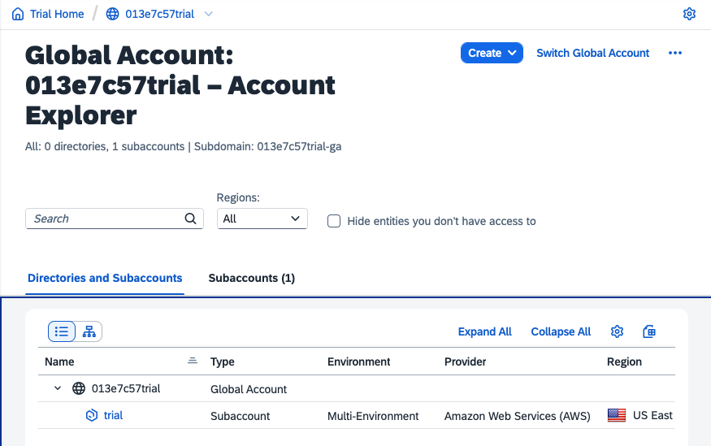

# Exercise 02 - Authenticating and managing configuration

At the end of this exercise, you'll have successfully authenticated with the btp CLI for your SAP BTP account and know about what configuration there is & how to control where it's kept.

## Gather the information required

To authenticate with the btp CLI so you can access and manage the resources in your BTP account, you need certain items of information.

👉 Make sure you have these items to hand:

|Item|Description|
|-|-|
|btp CLI server URL|The remote endpoint for the btp CLI. This is usually fixed, and is currently `https://cpcli.cf.eu10.hana.ondemand.com` for all users.|
|Global account subdomain|The subdomain for your global account on SAP BTP.|
|Username|The username with which you log on to the BTP account.|
|Password|The password with which you log on to the BTP account.|

You can see an example of the subdomain for this sample trial global account, just underneath the "Account Explorer" heading:



## Authenticate

If you managed to check out the "Usage" information and the output from `btp --help` [at the end of the previous exercise](../01-installing/README.md#questions) you'll have seen that there are "General actions" as well as BTP resource specific actions. One of these general actions is "login".

👉 Use that now to authenticate, supplying the information you gathered in the previous section:

```bash
btp login
```

Here's an example authentication flow for trial global account 8fe7efd4trial:

```text
user: user $ btp login
SAP BTP command line interface (client v2.14.0)

CLI server URL [https://cpcli.cf.eu10.hana.ondemand.com]>
Connecting to CLI server at https://cpcli.cf.eu10.hana.ondemand.com...

Global account subdomain>8fe7efd4trial-ga
User>qmacro+blue@gmail.com
Password>

Login successful
We stored your configuration file at: /home/user/.config/.btp/config.json

Current target:
  Global account (subdomain: 8fe7efd4trial-ga)

Tip:
    For more information on the targeting mechanism, use 'btp help target'.

OK
```

Here's another example authentication flow, for a global account with the subdomain "sap-developer-advocates-free-tier", where the user has chosen to use single sign on (SSO) with the browser, using the `--sso manual` parameter:

```text
user: user $ btp login --sso manual
SAP BTP command line interface (client v2.24.0)

CLI server URL [https://cpcli.cf.eu10.hana.ondemand.com]>
Connecting to CLI server at https://cpcli.cf.eu10.hana.ondemand.com...

Global account subdomain> sap-developer-advocates-free-tier

Please authenticate at: https://cpcli.cf.eu10.hana.ondemand.com/login/v2.24.0/browser/d1fc0c69-d59e-4f7e-9a34-de852251caaa
Waiting for user authentication to complete (use Ctrl+C to abort)...

Login successful
We stored your configuration file at: /home/user/.config/btp/config.json

Target hierarchy:
  Global account (subdomain: sap-developer-advocates-free-tier)
  └─ Subaccount (ID: bbcd39a3-4047-4e7b-bba2-88604cb7faaa)

Tips:
    Commands are executed in the target, unless specified otherwise using a parameter. To change the target, use 'btp target'.
    For an explanation of the targeting mechanism, use 'btp help target'.

OK
```

> In this example, the user selects the URL presented at the "Please authenticate at" prompt and opens it in the browser, and authenticates there if required. Then the flow automatically continues.

Any issues logging in could be down to a number of factors - for example, if you're using two-factor authentication (2FA), remember to append your 2FA code to your password as you enter it.

## Set your desired subaccount as a target

It's likely that you'll often be wanting to work with some of your SAP BTP resources at the subaccount level. In a trial global account, this is the "trial" subaccount that's automatically created (you can see an example of this "trial" subaccount in the screenshot earlier). It will be different in other accounts.

> The examples in this section will continue to use the trial subaccount but you should follow along using [whatever subaccount you have identified for this CodeJam](../../prerequisites.md#subaccount-and-cloud-foundry-environment). A subaccount is where you'll be normally operating - where you'll have environment instances (Cloud Foundry or Kyma runtimes, for example). Think of the global account as a container for multiple subaccounts.

Rather than have to specify this subaccount each time in various btp CLI invocations, you can tell the btp CLI once, with the `target` general action, and then it will be used when required.

You can find out more about the `target` action, and any action, with the general action `help`, i.e. `btp help target`.

👉 Do this now, and examine the output:

```bash
btp help target
```

Here's an example invocation:

```text
user: user $ btp help target
Connecting to CLI server at https://cpcli.cf.eu10.hana.ondemand.com...
Usage: btp [OPTIONS] target [--global-account SUBDOMAIN] [--directory ID] [--subaccount ID]

Set the default context for command execution.

Targeting works along the hierarchy of your account model:
 - After login, the global account is targeted by default.
 - When targeting a subaccount or directory, you can execute commands in its parent directory or global account by using '-dir' or '-ga' without value.
 - Commands that only work on directory or global account level will be executed in the parent directory or global account of the current target.

Parameters:
  --global-account,-ga SUBDOMAIN  (Optional) You can omit SUBDOMAIN as only the global account of the active login can be targeted.
  --directory,-dir ID             (Optional) The ID of the directory to be targeted.
  --subaccount,-sa ID             (Optional) The ID of the subaccount to be targeted. To find your subaccount ID, use 'btp list accounts/subaccount'.

Tips:
    To overwrite the targeted context for a specific command call, you can specify the respective parameter.
    To work in a different global account, log in to this global account using 'btp login'.

Further documentation:
    https://help.sap.com/viewer/65de2977205c403bbc107264b8eccf4b/Cloud/en-US/720645a3ed3945bd8d97a670b948ac07.html

OK
```

So set your desired subaccount as the target now.

👉 Try this (substituting your subaccount's name for "trial", if it's different):

```bash
btp target --subaccount trial
```

Hmm, that's not quite right, is it?

Here we see there's a distinction between the display name and the ID. The help above, as well as the error message you just saw as a result of not actually specifying a real ID, gives us a clue as to how we find it.

👉 Do that now, using the "list" action on the "subaccount" object in the "accounts" group:

```bash
btp list accounts/subaccount
```

Here's the sort of thing that you should see:

```text
subaccounts in global account fdce9323-d6e6-42e6-8df0-5e501c90a2be...

subaccount id:                         display name:   subdomain:      region:   beta-enabled:   parent id:                             parent type:     state:   state message:
f78e0bdb-c97c-4cbc-bb06-526695f44551   trial           8fe7efd4trial   eu10      false           fdce9323-d6e6-42e6-8df0-5e501c90a2be   global account   OK       Subaccount created.


OK
```

> By the way, here's where the plural/singular approach to the group and object in the invocation comes in (we thought about this at the end of the previous exercise). In the `btp` invocation you just made, group "accounts" is plural, while the object "subaccount" is singular.

The output should include a detailed line for your subaccount, showing its ID (which starts `f78e0bdb` here - the ID for your subaccount will of course be different) as well as its name (which is `trial` in this example).

👉 Try the `target` command again, this time specifying the ID of your subaccount, rather than the display name. Here's an example, with output:

```text
user: user $ btp target --subaccount f78e0bdb-c97c-4cbc-bb06-526695f44551
Targeting subaccount 'f78e0bdb-c97c-4cbc-bb06-526695f44551'. Commands that only work on global account level will be executed in the parent global account.

Current target:
  Global account (subdomain: 8fe7efd4trial-ga)
  └─ Subaccount (ID: f78e0bdb-c97c-4cbc-bb06-526695f44551)

Tips:
    To execute a command in the parent global account, use parameter '-ga' without value.
    To execute a command in a different context, specify the subaccount, directory, or global account in the command.

OK
```

Any `btp` invocation output displays what the current target is; note now that not only is the global account targeted but also the subaccount:

```text
Current target:
  Global account (subdomain: 8fe7efd4trial-ga)
  └─ Subaccount (ID: f78e0bdb-c97c-4cbc-bb06-526695f44551)
```

> You can make your command line life more comfortable with custom functions and scripts, such as one to get the ID for a subaccount, given its display name. We'll cover this in [a later exercise in this session](../05-btp-guids-cli-in-practice/README.md). See also [the `bgu` script in action as part of the btp CLI section of the 2021 SAP TechEd Developer Keynote](https://youtu.be/OmEx598qAI8?t=180) and also the two related blog posts in the [Further reading](#further-reading) section below.

## Find and organize your btp CLI configuration

Directly after logging in just a few moments earlier, you may have noticed that the success message included a line about configuration (see the [Authenticate](#authenticate) section earlier for the context):

```text
We stored your configuration file at: /home/user/.config/.btp/config.json
```

> You can also see this configuration information in the output shown when you invoke `btp` on its own.

This configuration file holds information about your currently authenticated session, plus whatever IDs you have targeted. Feel free to have a look at this file (the simplest way would be to use `cat`, i.e. `cat /home/user/.config/.btp/config.json` but you could also use `jq`, i.e. `jq . /home/user/.config/.btp/config.json`), but don't show the contents to anyone - it includes tokens that are used to authorize your btp CLI activities.

Earlier versions of the btp CLI put the configuration file in a temporary location by default - a workaround for this is described in the SAP Tech Bytes blog post on managing configuration in the [Further reading](#further-reading) section below. This has changed more recently and you can see from the message that the default location is within a btp CLI specific directory in a `$HOME/.config/` directory. This is nice because it conforms to an open standard (the [XDG Base Directory Specification](https://specifications.freedesktop.org/basedir-spec/basedir-spec-latest.html)) and specifically the default value of `XDG_CONFIG_HOME`.

The SAP Help topic [Specify the Location of the Configuration File](https://help.sap.com/products/BTP/65de2977205c403bbc107264b8eccf4b/e57288d7f2aa4e59a8f70b08b82a933d.html) explains how you can override this default location either with the `--config` option or by specifying the location in the environment variable `BTP_CLIENTCONFIG`.

> The name used to be `SAPCP_CLIENTCONFIG` which is a hold over from the previous name of the platform and the tool name at the time.

If you're like me, you may like to organize your configuration files within `$HOME/.config/` as non-hidden directories, so having a directory called `$HOME/.config/.btp/` may be less than ideal. So if this is something you also feel strongly about, use this step to address it.

> A file or directory which has a name starting with a period (`.`) is considered "hidden", as it won't show up in any listing, unless you explicitly ask for them to be shown (incidentally, this well-known and almost universal feature [started out as a mistake due to a programming shortcut with unintended consequences](https://web.archive.org/web/20180827160401/https://plus.google.com/+RobPikeTheHuman/posts/R58WgWwN9jp)?). While it's fairly common to have the `$HOME/.config/` directory itself as a hidden directory, it makes more sense to want to be able to easily see what subdirectories are in there - for what programs and systems you have configuration.

### Rename the config directory

👉 First, rename the actual `.btp/` directory to `btp/` so it's not a hidden directory any more:

```bash
mv $HOME/.config/.btp/ $HOME/.config/btp/
```

### Run the btp CLI and see what you get

Now you're halfway through the reorganization - you've moved the configuration file but `btp` doesn't know that yet.

👉 So what happens when you invoke `btp` now? Try it:

```bash
btp
```

Here's the sort of thing you will most likely see:

```text
user: user $ btp
Welcome to the SAP BTP command line interface (client v2.14.0)

Usage: btp [OPTIONS] ACTION [GROUP/OBJECT] [PARAMS]

CLI server URL:                    not set
User:                              not set
Configuration:                     /home/user/.config/.btp/config.json

You are currently not logged in.

Tips:
    To log in to a global account of SAP BTP, use 'btp login'. For help on login, use 'btp help login'.
    To display general help, use 'btp help'.

OK
```

Whoops - it thinks you're no longer authenticated because it can't find the configuration file that contains the token. Let's continue and see how that is resolved again.

> This little test will cause the re-creation of a btp CLI config file in the `.config/.btp/` directory, but we don't want that to hang around, so you can delete it if you want, like this: `rm -rf $HOME/.config/.btp`

### Specify a permanent value for `BTP_CLIENTCONFIG`

👉 Now append another line to your `.bashrc` file to set the `BTP_CLIENTCONFIG` environment variable to this location (again, be sure to use the `>>` append redirection operator so you don't truncate the file and use single quotes where and as shown):

```bash
echo 'export BTP_CLIENTCONFIG=$HOME/.config/btp/config.json' >> $HOME/.bashrc
```

Using the `bu` alias will cause this new environment variable to be set in your current shell, so you can then try invoking `btp` again.

👉 Do that now, and then check that the environment variable is indeed set appropriately:

```bash
bu
env | grep BTP
```

### Run the btp CLI again

Running the btp CLI again with the configuration reorganized into its new location should allow you to end this exercise happy - it can find the configuration file (with the help of the `BTP_CLIENTCONFIG` environment variable) and therefore the token, and you're as you were - still authenticated.

👉 Try it:

```bash
btp
```

This time it should be different:

```text
user: user $ btp
SAP BTP command line interface (client v2.14.0)

Usage: btp [OPTIONS] ACTION [GROUP/OBJECT] [PARAMS]

CLI server URL:                    https://cpcli.cf.eu10.hana.ondemand.com (server vUNKNOWN)
User:                              P2003480944 (qmacro+blue@gmail.com) at accounts.sap.com
Configuration:                     /home/user/.config/btp/config.json

Current target:
  Global account (subdomain: 8fe7efd4trial-ga)
  └─ Subaccount (ID: f78e0bdb-c97c-4cbc-bb06-526695f44551)

Tips:
    For information about the targeting mechanism, use 'btp help target'.
    To display general help, use 'btp help'.

OK
```

Great - the configuration is now in a non-hidden `btp/` subdirectory within your `$HOME/.config/` directory, and all is well with `btp`.

## Summary

At this point you've logged in with `btp` and have your global account and "trial" subaccount targeted. You've also seen what the client configuration looks like, and how to control its location.

## Further reading

* [SAP Tech Bytes: btp CLI – logging in](https://blogs.sap.com/2021/09/07/sap-tech-bytes-btp-cli-logging-in/)
* [SAP Tech Bytes: btp CLI – managing configuration](https://blogs.sap.com/2021/09/14/sap-tech-bytes-btp-cli-managing-configuration/)
* [Getting BTP resource GUIDs with the btp CLI – part 1](https://blogs.sap.com/2021/11/24/getting-btp-resource-guids-with-the-btp-cli-part-1/)
* [Getting BTP resource GUIDs with the btp CLI – part 2 – JSON and jq](https://blogs.sap.com/2021/12/01/getting-btp-resource-guids-with-the-btp-cli-part-2-json-and-jq/)
* [Redirections in Bash](https://www.gnu.org/software/bash/manual/html_node/Redirections.html) (to explain `>>` and related operators)
* [Booting our 2022 live stream series with a review of Developer Keynote btp CLI scripting](https://www.youtube.com/watch?v=1jekfZJ3fTk)
* [Managing technical users for BTP platform access](https://blogs.sap.com/2022/09/20/managing-technical-users-for-btp-platform-access/)
]

---

If you finish earlier than your fellow participants, you might like to ponder these questions. There isn't always a single correct answer and there are no prizes - they're just to give you something else to think about.

1. Why were you told to use single quotes when echoing text into the `.bashrc` file? What would have happened if you'd use double quotes?
1. Is it possible to authenticate using Single Sign-On (SSO)? How would you go about finding out?
