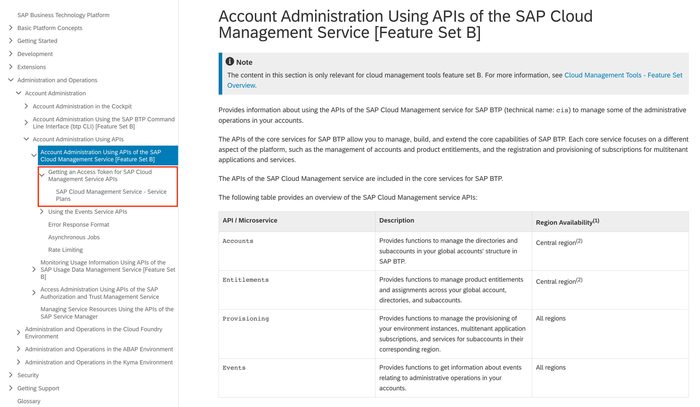
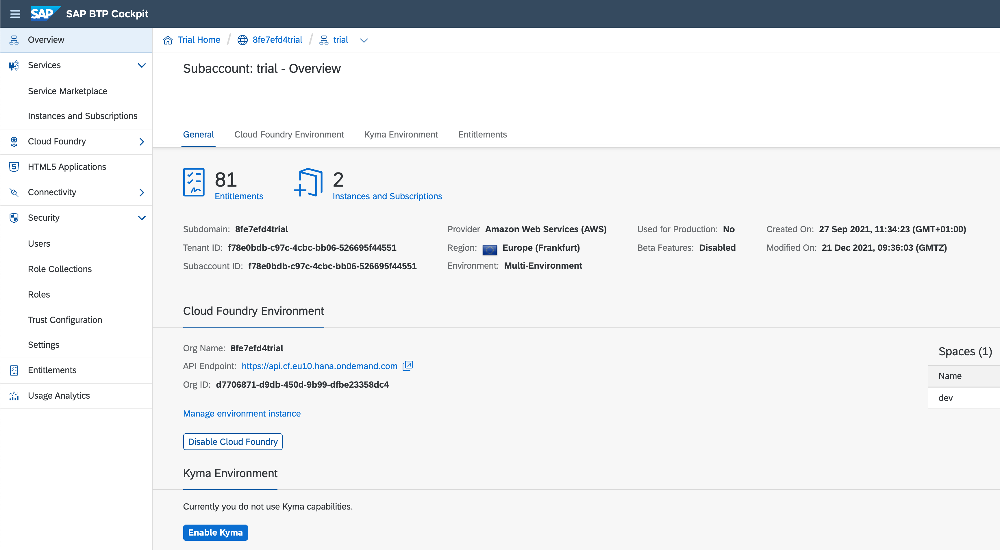

# Exercise 05 - Preparing to call a Core Services API

The btp CLI implementation has a client / server nature. The server component facilitates calls to APIs in the [Core Services for SAP BTP](https://api.sap.com/package/SAPCloudPlatformCoreServices/rest) package. So the btp CLI effectively gives you a comfortable way of consuming those APIs that are specifically designed to let you "manage, build, and extend the core capabilities of SAP BTP".

During the course of this and also the subsequent two exercises you'll see that first hand, by observing that the JSON you saw in the previous exercise (emitted from `btp --format json list accounts/available-region`) is effectively the same as the output from a call to the corresponding API endpoint.

While the process of calling an API is not complicated, there are some moving parts that work together are important for us to thoroughly understand. We'll do that together by taking a steady journey through those moving parts, with enough time to reflect and get things straight in our minds.

In this exercise, you'll do some preparatory work that's required. In the next exercise, you'll use the information gained in this exercise (mostly the CF API endpoint that you need) to obtain credentials for the call. And in the exercise that follows that, you'll use those credentials to make the call and then examine the output.

Ready?

## Learning about the API structure, authentication and use

The endpoint in question lives within the [Entitlements Service](https://api.sap.com/api/APIEntitlementsService/overview) API, specifically within the "Regions for Global Account" group. You can see this in the SAP API Business Hub:


It's worth pausing a second to think about how APIs are organized on the SAP API Business Hub. There are API packages, APIs, and endpoints that are collected into groups. The hierarchy is as follows, showing where this endpoint is:

```
+-------------+
|             |
| API Package |      Core Services for SAP BTP
|             |
+-------------+
       |
+-------------+
|             |
|     API     |      Entitlements Service
|             |
+-------------+
       |
+-------------+
|             |
|    Group    |      Regions for Global Account
|             |
+-------------+
       |
+-------------+
|             |
|  Endpoint   |      /entitlements/v1/globalAccountAllowedDataCenters
|             |
+-------------+
```

### Credentials for API calls

The API endpoints are protected, and calls to them require credentials. For OAuth 2.0 protected resources, these credentials are usually in the form of access tokens, long opaque strings of characters. In general, obtaining an access token involves using information related to an instance of a service (on SAP BTP) to which the API relates. This information is contained in a binding (also known as a service key in Cloud Foundry contexts).

So to get to the stage where an access token is obtained, an instance of a service is created. When creating a service instance, a plan for that service must be specified. From the instance, a binding can then be created. And using information in this binding, an access token can be requested. There are different flows, also known as "grant types", that describe how the request is made. Once the access token is received, it can be used to authenticate the API call.

While we're in the mood for ASCII art, here's that in diagram form:

```
+----------------+      +----------------+      +----------------+
|    Service     |      |    Instance    |      |    Binding     |
|                |--+-->|                |----->|                |
|                |  |   |                |      |                |
+----------------+  |   +----------------+      +----------------+
        |           |                                   |
        |           |                                   |
        |           |                                   |
+----------------+  |                                   |
|      Plan      |  |                                   |
|                |--+                                   |
|                |                                      |
+----------------+                                      |
                                                        |
        +-----------------------------------------------+
        |
        V
+----------------+      +----------------+
|     Token      |      |    API Call    |
|                |----->|                |
|                |      |                |
+----------------+      +----------------+
```

### Understanding what's required for a token request

We're eventually (in a subsequent exercise) going to make a call to the one endpoint in the Regions for Global Account group, i.e. to:

```
/entitlements/v1/globalAccountAllowedDataCenters
```

The endpoints in the Entitlement Service API are protected by the OAuth 2.0 "Resource Owner Password Credentials" grant type, otherwise known as the "Password" grant type (this grant type is considered legacy, but is still used to protect some resources in this area). See the link to understanding OAuth 2.0 grant types in the [Further reading](#further-reading) section below for more background information.

👉 Head over to the [Entitlements Service API overview](https://api.sap.com/api/APIEntitlementsService/overview) page on the SAP API Business Hub.

👉 Find and follow the link, under the Documentation heading, to the [Account Administration Using APIs of the SAP Cloud Management Service](https://help.sap.com/docs/BTP/65de2977205c403bbc107264b8eccf4b/17b6a171552544a6804f12ea83112a3f.html?locale=en-US) section in the SAP Help Portal, where you'll see something like this:



👉 Explore the two nodes highlighted in red, to see that it's the "SAP Cloud Management" service that is relevant here, and that the technical name for this service is `cis`. See also that there are two plans for the SAP Cloud Management service: `central` and `local`.

The `central` plan affords a little more access than the `local` plan so we'll go for the `central` plan. This is where these values fit into our diagram:

```
+----------------+      +----------------+      +----------------+
|    Service     |      |    Instance    |      |    Binding     |
|      cis       |--+-->|                |----->|                |
|                |  |   |                |      |                |
+----------------+  |   +----------------+      +----------------+
        |           |                                   |
        |           |                                   |
        |           |                                   |
+----------------+  |                                   |
|      Plan      |  |                                   |
|     central    |--+                                   |
|                |                                      |
+----------------+                                      |
                                                        |
        +-----------------------------------------------+
        |
        V
+----------------+      +----------------+
|     Token      |      |    API Call    |
|                |----->|                |
|                |      |                |
+----------------+      +----------------+
```

There are different places that a service instance can be created, but [as you have a Cloud Foundry environment set up](../../prerequisites.md#subaccount-and-cloud-foundry-environment), we'll use that.

## Determining your CF API endpoint

So the choice of Cloud Foundry (CF) as an environment for the service instance means that, in a similar way to how we logged in with the btp CLI, we now must log in with the CF CLI, `cf`, so that we can use that tool to create the service instance.

To log in, this we need to know which endpoint we must connect to, as we'll need to specify it like this:

```bash
cf login -a <API endpoint URL>
```

To discover what the endpoint URL is, you can just look in the BTP Cockpit, where it's shown as the value for "API Endpoint":



But this is all about hands-on on the command line, and if we're going to be automating things, looking in the cockpit is not going to work for us. So let's determine the API endpoint in a different way, using the btp CLI to discover what it is.

What we're going to do is systematically work through the information that's available to us from various resources that we can retrieve via the btp CLI. While we'll be doing some things manually here, and making use of copy/paste (so that we can follow everything step by step), the individual steps can all be automated (as you'll see in a [later section](#bonus-determining-the-cf-api-endpoint-with-a-script)).

> The SAP BTP account, subaccount and CF environment instance shown in the samples here are based on a trial subaccount; your direct experience may show different data as the structure of subaccounts in your SAP BTP account will be different, but the principles are the same.

The general approach that we'll be following is this:

1. [find the subaccount GUID](#finding-the-subaccount-guid)
1. [get the environment instance details](#get-the-environment-instance-details)
1. [extract the API endpoint value](#extracting-the-api-endpoint-value)

### Installing "interactive jq"

We'll be using the `--format json` option and working through details of certain btp CLI calls, building on our knowledge of `jq` filters from the previous exercise. To make this a little more comfortable, we'll install a wrapper around `jq` so we can interact with the JSON data and build up our filters bit by bit. The wrapper is called [ijq](https://sr.ht/~gpanders/ijq/) (for "interactive jq") and we can manually install it in our App Studio Dev Space.

👉 At the prompt in your Dev Space's terminal, run the following command, which will download the [latest release tarball](https://git.sr.ht/~gpanders/ijq/refs/v0.4.0) specifically for the Linux platform (remember, this Dev Space is a Linux environment) and extract the binary `ijq` into the `bin/` directory in your home directory (remember that this `bin/` directory is [where you installed the btp CLI in an earlier exercise](../01-installing#add-your-bin-directory-to-the-path)):

```bash
IJQVER=0.4.0
curl \
  --url "https://git.sr.ht/~gpanders/ijq/refs/download/v$IJQVER/ijq-$IJQVER-linux-amd64.tar.gz" \
  | tar \
    --extract \
    --gunzip \
    --file - \
    --directory "$HOME/bin/" \
    --strip-components 1 \
    "ijq-$IJQVER/ijq"
```

If you invoke `ijq` now to test it out, you should see something like this:

```
ijq - interactive jq

Usage: ijq [-cnsrRMSV] [-f file] [filter] [files ...]

Options:
  -C    force colorized JSON, even if writing to a pipe or file
  -H string
        set path to history file. Set to '' to disable history. (default "/home/user/.local/share/ijq/history")
  -M    monochrome (don't colorize JSON)
  -R    read raw strings, not JSON texts
  -S    sort keys of objects on output
  -V    print version and exit
  -c    compact instead of pretty-printed output
  -f filename
        read initial filter from filename
  -jqbin string
        name of or path to jq binary to use (default "jq")
  -n    use `null` as the single input value
  -r    output raw strings, not JSON texts
  -s    read (slurp) all inputs into an array; apply filter to it
```

### Finding the subaccount GUID

Because of the API requirements on the server side, a lot of btp CLI operations require us to deal in globally unique identifiers (GUIDs) rather than names. In this first step, we'll determine the GUID for the subaccount we're using, based on the name.

Let's get our fingers warmed up by asking for a simple list of subaccounts, first, in plain text format rather than JSON.

👉 Run this btp CLI invocation, remembering to make use of the [autocomplete](03-autocomplete-and-exploration/README.md#set-up-autocomplete) features:

```bash
btp list accounts/subaccount
```

You should get output similar to this:

```
subaccounts in global account fdce9323-d6e6-42e6-8df0-5e501c90a2be...

subaccount id:                         display name:      subdomain:                             regi
on:   beta-enabled:   parent id:                             parent type:     state:   state message:

898b51f0-0c04-41b3-9176-0749fc985211   ho060-subaccount   ho060-8fe7efd4trial                    eu10
      false           7abcfc5f-e570-46c6-9988-6de663085ca6   directory        OK       Subaccount cre
ated.
41daa97f-e645-462f-8adc-7957a6d1b4bc   testeu10           30a0b628-2347-440a-9a93-1c1effd64200   eu10
      false           3f1ed385-5f1f-4b61-add5-e20bdd273b13   directory        OK       Subaccount mov
ed.
cd76fdef-16f8-47a3-954b-cab6678cc24d   testsubaccount     a253215a-736f-4e9a-b0c1-02052f8f0c2e   ap21
      false           fdce9323-d6e6-42e6-8df0-5e501c90a2be   global account   OK       Subaccount cre
ated.
f78e0bdb-c97c-4cbc-bb06-526695f44551   trial              8fe7efd4trial                          eu10
      false           fdce9323-d6e6-42e6-8df0-5e501c90a2be   global account   OK       Subaccount cre
ated.
```

The output is pretty wide, and difficult to read; you can define a function for the duration of your shell session (or add it to your `.bashrc` file for a more permanent solution) like this:

```bash
trunc() { cut -c1-$(tput cols); }
```

👉 Now try the same invocation but pipe the output into this function:

```bash
btp list accounts/subaccount | trunc
```

The output should now be a little more readable (at the expense of losing detail of course):

```
subaccounts in global account fdce9323-d6e6-42e6-8df0-5e501c90a2be...

subaccount id:                         display name:      subdomain:                             regi
898b51f0-0c04-41b3-9176-0749fc985211   ho060-subaccount   ho060-8fe7efd4trial                    eu10
41daa97f-e645-462f-8adc-7957a6d1b4bc   testeu10           30a0b628-2347-440a-9a93-1c1effd64200   eu10
cd76fdef-16f8-47a3-954b-cab6678cc24d   testsubaccount     a253215a-736f-4e9a-b0c1-02052f8f0c2e   ap21
f78e0bdb-c97c-4cbc-bb06-526695f44551   trial              8fe7efd4trial                          eu10
```

> You'll still see some blank lines and an "OK" - this is extraneous output that is sent (to STDERR) by the `btp` invocation; if it disturbs you, you can get rid of it by redirecting STDERR to `/dev/null`, i.e. to oblivion. Here's an example: `btp list accounts/subaccount 2> /dev/null | trunc`. Note that redirecting STDERR like this is not ideal, as you won't see any genuine error messages. There's an active discussion in the btp CLI product team as to how to best suppress this extra information so we don't have to use this STDERR redirection workaround.

For the subaccount in question ("trial" in this sample), we want to get the GUID, which is `f78e0bdb-c97c-4cbc-bb06-526695f44551`. Again, we could copy/paste it somehow, but that's not useful if we want to do this, or something like it, in an automated fashion. Instead, we'll ask for the JSON representation of this information and parse it out from that.

👉 Do that now, like this:

```bash
btp --format json list accounts/subaccount
```

You'll see output that starts like this (redacted here for brevity):

```json
{
  "value": [
    {
      "guid": "f78e0bdb-c97c-4cbc-bb06-526695f44551",
      "technicalName": "f78e0bdb-c97c-4cbc-bb06-526695f44551",
      "displayName": "trial",
      "globalAccountGUID": "fdce9323-d6e6-42e6-8df0-5e501c90a2be",
      "parentGUID": "fdce9323-d6e6-42e6-8df0-5e501c90a2be",
      "parentType": "ROOT",
      "region": "eu10",
      "subdomain": "8fe7efd4trial"
    }
  ]
}
```

👉 Rerun that command and pass it into our interactive `jq` program `ijq`:

```bash
btp --format json list accounts/subaccount | ijq -r
```

> We're using the `-r` option to ask `ijq` to emit raw output when it exits, rather than try to produce JSON; this is so that when we do identify and output the GUID, it won't be enclosed in double quotes.

The layout of `ijq` consists of four sections:

* Input: the JSON data we've passed in
* Output: the result of applying our filter
* Filter: the filter itself
* Error: any errors with the filter are shown here

You'll see that in the Input section, `.value` is suggested, as it's a directly available property in the outermost object.

👉 Hit the Tab key to accept the suggestion, and in a similar way to how we [listed the locations of the CF data centers](../04-retrieving-parsing-json-output#listing-the-locations-of-the-cf-data-centers) in a previous exercise, expand this filter, replacing the name "trial" with the name of your subaccount:

> Don't worry about messages appearing in the Error section as you type, it's just that `ijq` is trying to parse the filter as you enter characters one by one.

```jq
.value[] | select(.displayName == "trial")
```

This should reduce the content of the Output section, from (initially) the entire input JSON, to just the object that represents your chosen subaccount.

👉 Once you see just the single object, append the `guid` property to the filter to ask for just the value of the GUID from that object, like this:

```jq
.value[] | select(.displayName == "trial").guid
```

Here's a rough recording of how this might look in `ijq` (minus the framing around each of the sections which were lost in the [asciicast2gif](https://github.com/asciinema/asciicast2gif) conversion):


> Note the errors are generated in realtime as the filter is being constructed, and disappear once the filter is complete, or at a stage that is valid `jq`.

👉 Once you can see the GUID displayed in the Output section, you can hit Enter and it will be output from the `ijq` invocation; in addition it `ijq` will show you (on STDERR) the filter you used.

You should see something similar to this back in the shell:

```
.value[] | select(.displayName=="trial").guid
f78e0bdb-c97c-4cbc-bb06-526695f44551
```

This was a bit of a [round the houses](https://wordhistories.net/2018/03/05/go-round-houses/) journey but hopefully you have a GUID and more importantly you understand how it was obtained.

Before moving on to the next step, let's rerun the command but this time capture this GUID into a shell variable so we can use it in the next step. You'll do this using command substitution, which is described in a link in the [Further reading](#further-reading) section below.

👉 Call up the previous command (use the up-arrow to do this, or even try `Ctrl-R` for a reverse search over your command history), make it look like this, and run it:

```bash
guid=$(btp --format json list accounts/subaccount | ijq -r)
```

> `ijq` stores a history of your previous successful filters, so to retrieve what you used already, remove the `.` from the Input (so that the Input section is empty) and the previous filter should show up for you to select.

When you hit Enter, you'll be returned to the shell, but now the GUID will be captured in the `guid` variable.

👉 Check this by echoing it out:

```bash
echo $guid
```

It should emit the GUID that you've seen before.

### Get the environment instance details

Another member of the "accounts" group of objects upon which btp CLI can act is the "environment-instance". And it's this object that we should find and retrieve details for next.

👉 First, use the following command to list all the environment instances for the subaccount, using the GUID you have in the `guid` variable, thus:

```bash
btp list accounts/environment-instance --subaccount "$guid"
```

This should return something like this (again, truncated here to fit within the page width) - your output may show different records:

```
Showing environment details for subaccount f78e0bdb-c97c-4cbc-bb06-526695f44551:

environment name      environment id                         environment type   state   state m
8fe7efd4trial_trial   9CCFC252-049E-4E33-92C8-D4040A9B9C13   kyma               OK      Environ
8fe7efd4trial         2C71C5DD-E9EB-4D10-9148-8A4F4B38A12C   cloudfoundry       OK      Environ
```

It's the CF environment instance we're interested in (marked "cloudfoundry" here).

👉 Now make the same call but request JSON output, and have a brief look using `ijq`:

```bash
btp --format json list accounts/environment-instance --subaccount "$guid" | ijq
```

You'll see that the structure of the data looks like this:

```json
{
  "environmentInstances": [
    { "id": "..." },
    { "id": "..." }
  ]
}
```

In other words, it's an object with a single property, `environmentInstances`, which has an array `[...]` as its value, and each element of that array is an object representing the details for an environment instance.

👉 With this knowledge, construct a further call back on the command line that uses a simple `jq` filter to extract the relevant object, like this:

```bash
btp --format json list accounts/environment-instance --subaccount "$guid" \
  | jq '.environmentInstances[]|select(.environmentType == "cloudfoundry")'
```

This should return a single JSON object that looks like this:

```json
{
  "id": "2C71C5DD-E9EB-4D10-9148-8A4F4B38A12C",
  "name": "8fe7efd4trial",
  "brokerId": "8157B9D8-011B-449F-A028-EC03B56A479A",
  "globalAccountGUID": "fdce9323-d6e6-42e6-8df0-5e501c90a2be",
  "subaccountGUID": "f78e0bdb-c97c-4cbc-bb06-526695f44551",
  "tenantId": "f78e0bdb-c97c-4cbc-bb06-526695f44551",
  "serviceId": "fa31b750-375f-4268-bee1-604811a89fd9",
  "planId": "fc5abe63-2a7d-4848-babf-f63a5d316df1",
  "operation": "update",
  "parameters": "{\"instance_name\":\"8fe7efd4trial\",\"archetype\":\"trial\",\"status\":\"active\"}",
  "labels": "{\"Org Name:\":\"8fe7efd4trial\",\"API Endpoint:\":\"https://api.cf.eu10.hana.ondemand.com\",\"Org ID:\":\"d7706871-d9db-450d-9b99-dfbe23358dc4\"}",
  "customLabels": {},
  "type": "Update",
  "status": "Processed",
  "environmentType": "cloudfoundry",
  "landscapeLabel": "cf-eu10",
  "platformId": "d7706871-d9db-450d-9b99-dfbe23358dc4",
  "createdDate": 1632738918871,
  "modifiedDate": 1654678530403,
  "state": "OK",
  "stateMessage": "Environment instance status has been updated successfully.",
  "serviceName": "cloudfoundry",
  "planName": "standard"
}
```

You may be staring and wondering at the values for the `parameters` and `labels` properties here. Good. They do look a bit odd, but one of them is exactly the property that we need to look into further.

### Extracting the API endpoint value

If you [stare long enough](https://qmacro.org/blog/posts/2017/02/19/the-beauty-of-recursion-and-list-machinery/#initialrecognition), you'll realise that the values are string-encoded JSON. In other words, the values are actually objects, but encoded in JSON, but to be a string, each double quote character within the string need to be preserved and therefore escaped with a backslash (`\`).

> You can run the following invocations of the `jq` filters as shown here, or pipe the btp CLI JSON output into `ijq` and run them there - your choice.

👉 Call up the previous command and extend the `jq` filter to emit the value of the `label` property, thus:

```bash
btp --format json list accounts/environment-instance --subaccount "$guid" \
  | jq '
    .environmentInstances[]
    | select(.environmentType == "cloudfoundry").labels
  '
```

> To make things easier to read, this command now has the `jq` filter spanning multiple lines, but you can still copy/paste it as it stands here in its expanded form. Behold the power of the shell!

This should produce something like the following:

```json
"{\"Org Name:\":\"8fe7efd4trial\",\"API Endpoint:\":\"https://api.cf.eu10.hana.ondemand.com\",\"Org ID:\":\"d7706871-d9db-450d-9b99-dfbe23358dc4\"}"
```

What is going on here? This looks like JSON, with extra noise. It's JSON encoded as a string. That's what's going on. Luckily, `jq` has a way of converting to and from string-encoded JSON texts (see the [Further reading](#further-reading) section).

👉 Rerun the command again adding the `fromjson` builtin as follows:

```bash
btp --format json list accounts/environment-instance --subaccount "$guid" \
  | jq '
    .environmentInstances[]
    | select(.environmentType == "cloudfoundry").labels
    | fromjson
  '
```

You'll see something like the following produced, which is the JSON that was encoded in that string:

```json
{
  "Org Name:": "8fe7efd4trial",
  "API Endpoint:": "https://api.cf.eu10.hana.ondemand.com",
  "Org ID:": "d7706871-d9db-450d-9b99-dfbe23358dc4"
}
```

Et voila! We've found the API endpoint.

👉 Let's grab the specific value, by adding the `--raw-output` option (so that the value, which is a strong, is not enclosed in double quotes) and adding one more segment to the filter to specifically request the endpoint property:

```bash
btp --format json list accounts/environment-instance --subaccount "$guid" \
  | jq --raw-output '
    .environmentInstances[]
    | select(.environmentType == "cloudfoundry").labels
    | fromjson
    | ."API Endpoint:"
  '
```

> The [generic object index](https://stedolan.github.io/jq/manual/#GenericObjectIndex:.[%3Cstring%3E]) `."API Endpoint:"` is a little different to what we've seen up to now. Previously we've been able to refer to properties just using the property name, such as `.labels` or `.displayName`. But because this property name contains a space, we can't do that, and so have to enclose it in double quotes (if you're thinking that having JSON property names with spaces is odd, you're right). And just as a "by the way", the expression `."API Endpoint"` is just shorthand for the full generic object index expression `.["API Endpoint"]`.

> The environment instances have this label and parameter information squirreled away with the property names as you see here, and in some cases -- like here -- include a colon too. This is definitely odd. Moreover, the colon appears as part of these property names only for some environment instances, and not others. We have an internal ticket raised with the API product team for both of these oddities, as well as the, erm, [space oddity](https://en.wikipedia.org/wiki/Space_Oddity).

In this particular sample case, the API endpoint is:

```text
https://api.cf.eu10.hana.ondemand.com
```

but it may be different for the CF environment instance in your subaccount. Whatever the value, we're now ready to move on to the next step, which is to log in with `cf`, specifying that API endpoint. That's coming up in the next exercise.

## Bonus: Determining the CF API endpoint with a script

In the [directory containing this specific README file](./), there's a script [get_cf_api_endpoint](./get_cf_api_endpoint). This script is an automated version of everything you've done in this section. If you've finished early, then you may wish to peruse the code, some of which you should recognize now.

You can try it out, too.

If you haven't done already, you'll first need to clone this repository into your Dev Space, so you have access to all the files, including this script.

👉 Follow the instructions for [Cloning this repository into your App Studio Dev Space](clone-this-repo.md).

After ensuring that you're still authenticated with the btp CLI (with `btp login`), you're ready run the script. It's a good idea at this stage to move to the directory containing it, and run it there, mostly because you'll be running another script in this same directory later. Here's how.

> If you don't specify a subaccount name, it will use "trial" by default. So if your subaccount name is not "trial", specify it as a parameter when invoking the script (e.g. `./get_cf_api_endpoint "My subaccount name"`).

👉 Move to the directory containing the script, and then run it:

```bash
cd $HOME/projects/cloud-btp-cli-api-codejam/exercises/05-core-services-api-prep/
./get_cf_api_endpoint
```

It should emit the API endpoint URL; the invocation should look something like this:

```
user: 05-core-services-api-prep $ ./get_cf_api_endpoint
https://api.cf.eu10.hana.ondemand.com
user: 05-core-services-api-prep $
```

## Summary

At this point you have gained some experience in understanding and parsing the JSON data that is available from various btp CLI commands, relating to your SAP BTP subaccount and CF environment instance. You have now added `ijq` to your toolset, which is a helpful way of building `jq` filters interactively, as well as exploring JSON.

## Further reading

* [Understanding OAuth 2.0 grant types](https://github.com/SAP-archive/cloud-apis-virtual-event/tree/main/exercises/02#3-understand-oauth-20-grant-types)
* [Getting an Access Token for SAP Cloud Management Service APIs](https://help.sap.com/products/BTP/65de2977205c403bbc107264b8eccf4b/3670474a58c24ac2b082e76cbbd9dc19.html?locale=en-US)
* [Command substitution](https://www.gnu.org/software/bash/manual/html_node/Command-Substitution.html) in Bash allows the output of a command to replace the command itself.

---

If you finish earlier than your fellow participants, you might like to ponder these questions. There isn't always a single correct answer and there are no prizes - they're just to give you something else to think about.

1. When listing the environment instances for the subaccount, how else might you make that btp CLI call, without using the `--subaccount` parameter?
1. The embedded, stringified JSON values in the `parameters` and `labels` properties are a bit strange. Stranger still are the names of some the properties in that embedded JSON. Have you ever seen property names containing whitespace (`Org Name`, `API Endpoint`, `Org ID`)? Moreover, depending on the age of your environment instance, these property names [may also contain colons](https://github.com/SAP-samples/cloud-btp-cli-api-codejam/blob/54ffaf98d6d98af142d9197ac0a8c9e85b5f014c/exercises/05-core-services-api-prep/get_cf_api_endpoint#L34) :-) Why do you think they exist this way?
1. What's the mechanism in the `get_cf_api_endpoint` script that defaults to "trial" as the name for the subaccount?
