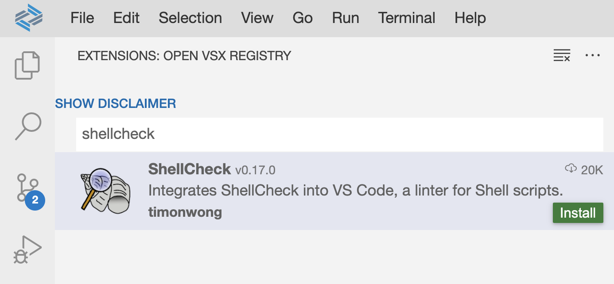

# Exercise 06 - Writing your first script

At the end of this exercise, you'll have written a short script that makes use of the btp CLI and in particular the JSON format output. This should give you confidence and an approach to write further scripts that suit your needs.

## The context of the script

It won't be a new script - in fact, it's the `get_cf_api_endpoint` script that you used in [a previous exercise](../04-json-format-and-apis/) when [obtaining an authorization token](../04-json-format-and-apis/README.md#obtain-an-authorization-token). It uses two different but related calls to the btp CLI and in both cases relies on the more predictable and machine-readable JSON ouptut.

The aim of this exercise is not only to walk you through the construction of this script, but also to give you a framework, or at least an approach for further scripts. And as the [overview](../../README.md#overview) for this hands-on session documentation suggests - this will be an opinionated approach. There are others, this is just one.

## Set up for writing a script

We'll be writing a script in Bash. There are many reasons for this - it's fairly universal, powerful enough to script with, and meshes perfectly with the interaction you have on the command line here in your Dev Space - there is no seam, no bump, when you switch between the command line and writing scripts. This hands-on session is not about which shell is best; the exercise here is based on the session author's opinion, you may disagree, and any ensuing debate is more than welcome!

Within the context of this temporary App Studio based Dev Space, there isn't much we need to set up, certainly not permanently. But there's one tool that is essential, and that is one that will provide linting in the form of static analysis; this will help you use best practices in this area. That tool is `shellcheck`.

> There's a link in this exercise's [Further reading](#further-reading) section to a blog post that explains more about `shellcheck` and also the excellent Google Shell Scripting Guide.

### Install the shellcheck tool

One option is to just download the `shellcheck` binary and use it as and when you wish, on the command line:

```bash
curl \
  --silent \
  --location \
  --url https://github.com/koalaman/shellcheck/releases/download/v0.8.0/shellcheck-v0.8.0.linux.x86_64.tar.xz \
  | tar \
    --extract \
    --directory $HOME/bin/ \
    --xz \
    --file - \
    --strip-components 1 \
    --wildcards \
    */shellcheck
```

👉 Another option is to install an extension to your Dev Space. There's a `shellcheck` extension available, and it's a couple of clicks away. Select the "Extensions" perspective (via the "four squares" icon in the far left column), then search for and install the extension.



Then, you'll get linting hints directly in the editor:


> You can read about installing this and another extension in VS Code in the Challenge page for 2021's Devtoberfest "Best Practice" week - see the link in [Further reading](#further-reading).

### Start with a script template

It's a good idea to start out with a simple script template. There's one in this exercise's directory.

👉 In a terminal in your Dev Space, move to this directory now and copy the template to a new file called `my_get_cf_api_endpoint`:

```bash
cd $HOME/projects/HO060/exercises/06-writing-your-first-script/
cp script-template my-get-cf-api-endpoint
```

> The template already has the executable bit set, so you shouldn't need to use `chmod +x my-get-cf-api-endpoint`.

Now you have a skeleton script with which to work.

👉 Open up the `my-get-cf-api-endpoint` in your Dev Space's editor, by selecting it in the Explorer and take a brief first look.


Here are a few brief notes on the template:

* The [hashbang](https://en.wikipedia.org/wiki/Shebang_(Unix)) uses `env` to find the `bash` interpreter; others might prefer hardcoding the path to it (i.e. `/bin/bash` in the context of this Dev Space), but the `env` based approach is more portable and (contrary to what some say) no less secure
* Two helpful options are for the script to exit immediately if any error occurs (rather than mask errors) - these and more are explained in this [Bash strict mode](https://gist.github.com/mohanpedala/1e2ff5661761d3abd0385e8223e16425) gist
* A common and clean pattern is to have a `main` function, that is called explicitly (at the end of the script source) with any and all values that were passed at invocation time (`"$@"`); the `main` function then dispatches to other functions as appropriate

## Understand the requirements

Let's take the description from the original script as a starting point:

_Determine the Cloud Foundry API endpoint for a given Cloud Foundry environment instance connected to a subaccount on BTP. Subaccount is identified by display name specified as a parameter, default is "trial"._

This breaks down to a number of steps:

* Receive as input a subaccount display name (defaulting to "trial")
* Get the GUID for that subaccount
* Get the details of the Cloud Foundry environment instance connected to that subaccount
* Extract the API Endpoint details from the Cloud Foundry data for that environment instance

## Implement the requirements

Let's take these step by step, each time adding a little more to the `my-get-cf-api-endpoint` script.

### Receive subaccount display name

👉 Add a line to the `main` function definition, replacing the template-based one that's already there, so it looks like this:

```bash
main() {

  local displayname="${1:-trial}"

}
```

This uses [shell parameter expansion](https://www.gnu.org/software/bash/manual/html_node/Shell-Parameter-Expansion.html) to default the value of "trial" if a display name isn't supplied.

You can already see the benefit of the `shellcheck` extension - it will give you hints as you go along, via warnings and errors that are extremely helpful:


> In what follows in this exercise, we'll assume the value "trial" is what we're working with.

### Write a function to get the subaccount GUID

👉 First, rename the template-based function called `somefunction` to `getsubguid`.

In the terminal, you can first try out the btp CLI command to retrieve subaccount details, with a tiny bit of `jq` to pull out what's needed.

👉 To start with, on the command line, retrieve the JSON details:

```bash
btp --format json list accounts/subaccount 2> /dev/null
```

The output should look something like this (some properties have been removed for brevity):

```json
{
  "value": [
    {
      "guid": "f78e0bdb-c97c-4cbc-bb06-526695f44551",
      "technicalName": "f78e0bdb-c97c-4cbc-bb06-526695f44551",
      "displayName": "trial",
      "globalAccountGUID": "fdce9323-d6e6-42e6-8df0-5e501c90a2be",
      "parentGUID": "fdce9323-d6e6-42e6-8df0-5e501c90a2be",
      "parentType": "ROOT",
      "region": "eu10",
      "subdomain": "8fe7efd4trial",
      "state": "OK",
      "modifiedDate": 1640079363073
    }
  ]
}
```

👉 Now use `jq` to extract an single object from the `value` array - the one where the value of the `displayName` property is the "trial", and then pick out the value of the `guid` property from that:

```bash
btp --format json list accounts/subaccount 2> /dev/null \
| jq '.value[] | select(.displayName == "trial") | .guid'
```

You should now get something like this:

```
"f78e0bdb-c97c-4cbc-bb06-526695f44551"
```

👉 Encode that into the new function, so it looks like this (see the notes below):

```bash
getsubguid() {

  # Get GUID for given subaccount display name

  local subname=$1
  btp --format json list accounts/subaccount 2> /dev/null \
    | jq -r --arg subname "$subname" '.value[] | select(.displayName == $subname) | .guid'

}
```

Some notes:

* The `subname` variable receives the value passed to the function from `main`, and is also used with `jq`'s `--arg` facility (see [this SO entry](https://stackoverflow.com/questions/34745451/passing-arguments-to-jq-filter) for an example) to pass the value to, and use within the `jq` script itself as `$subname`
* The `-r` option is used with `jq` to output the GUID in "raw" form, rather than as a double-quoted JSON string

### Amend main to call that function

👉 Now your first function `getsubguid` is ready, add a line to the `main` function to call it, so it now appears like this:

```bash
main() {

  local displayname="${1:-trial}"
  getsubguid "$displayname"

}
```

> If you haven't installed the Shellcheck extension, now would be a good time to run your script through shellcheck to make sure you haven't introduced any issues.

👉 Try the script out to see what you get. Here's a sample session:

```
user: 06-writing-your-first-script $ ./my-get-cf-api-endpoint
f78e0bdb-c97c-4cbc-bb06-526695f44551
user: 06-writing-your-first-script $
```

### Write a function to get environment instance details

Now we have the subaccount GUID, we can ask for a list of environment instances, filter that list down to the Cloud Foundry type and pick out the one that relates to the subaccount GUID determined.

> A trial BTP account gives you a subaccount called "trial" with a pre-created Cloud Foundry environment instance automatically.

Just like before, do this first manually, on the command line, to get a feel for it.

First, get a basic list of all the environment instances for your subaccount, requesting JSON directly (you may wish to use `jq` just to pretty print it, so that's shown here too). Here's the simplest approach, but won't be usable by you for copy-pasting because your GUID will be different:

```bash
btp --format json list accounts/environment-instance --subaccount f78e0bdb-c97c-4cbc-bb06-526695f44551 | jq .
```

👉 So as an alternative to specifying the GUID explicitly and directly, use the script as it stands so far to emit the GUID and store it in a variable, and then use that in the invocation:

```bash
subguid=$(./my-get-cf-api-endpoint)
btp --format json list accounts/environment-instance --subaccount $subguid | jq .
```

Here's the sort of thing that you should see (some properties have been omitted for brevity):

```json
{
  "environmentInstances": [
    {
      "id": "2C71C5DD-E9EB-4D10-9148-8A4F4B38A12C",
      "name": "8fe7efd4trial",
      "brokerId": "8157B9D8-011B-449F-A028-EC03B56A479A",
      "globalAccountGUID": "fdce9323-d6e6-42e6-8df0-5e501c90a2be",
      "subaccountGUID": "f78e0bdb-c97c-4cbc-bb06-526695f44551",
      "tenantId": "f78e0bdb-c97c-4cbc-bb06-526695f44551",
      "serviceId": "fa31b750-375f-4268-bee1-604811a89fd9",
      "parameters": "{\"instance_name\":\"8fe7efd4trial\",\"archetype\":\"trial\"}",
      "labels": "{\"Org Name:\":\"8fe7efd4trial\",\"API Endpoint:\":\"https://api.cf.eu10.hana.ondemand.com\",\"Org ID:\":\"d7706871-d9db-450d-9b99-dfbe23358dc4\"}",
      "customLabels": {},
      "environmentType": "cloudfoundry",
      "landscapeLabel": "cf-eu10",
      "serviceName": "cloudfoundry",
      "planName": "standard"
    }
  ]
}
```

👉 Now go beyond `jq`'s simple [identity function](https://stedolan.github.io/jq/manual/#Identity:.) (`.`) to get what's required (this assumes that you still have the GUID value in the `subguid` variable):

```bash
btp --format json list accounts/environment-instance --subaccount $subguid \
| jq -r \
  --arg subguid $subguid \
  '.environmentInstances[] | select(.environmentType == "cloudfoundry" and .subaccountGUID == $subguid)'
```

You should see something familiar, in that it's the same environment instance object, except that it's on its own, rather than within an `environmentInstances` array. Something like this (again, some properties omitted for brevity):


```json
{
  "id": "2C71C5DD-E9EB-4D10-9148-8A4F4B38A12C",
  "name": "8fe7efd4trial",
  "brokerId": "8157B9D8-011B-449F-A028-EC03B56A479A",
  "globalAccountGUID": "fdce9323-d6e6-42e6-8df0-5e501c90a2be",
  "subaccountGUID": "f78e0bdb-c97c-4cbc-bb06-526695f44551",
  "tenantId": "f78e0bdb-c97c-4cbc-bb06-526695f44551",
  "serviceId": "fa31b750-375f-4268-bee1-604811a89fd9",
  "parameters": "{\"instance_name\":\"8fe7efd4trial\",\"archetype\":\"trial\"}",
  "labels": "{\"Org Name:\":\"8fe7efd4trial\",\"API Endpoint:\":\"https://api.cf.eu10.hana.ondemand.com\",\"Org ID:\":\"d7706871-d9db-450d-9b99-dfbe23358dc4\"}",
  "customLabels": {},
  "environmentType": "cloudfoundry",
  "landscapeLabel": "cf-eu10",
  "serviceName": "cloudfoundry",
  "planName": "standard"
}
```

> Whether you like it or not, stringified JSON as values of scalar JSON properties (such as the `parameters` and `labels` properties here) are a thing. Luckily `jq` can deal with this nicely.

We're closing in on what we need - notice the value of the `labels` property there - it contains Cloud Foundry information.

👉 Encode this now in a new function in your script, like this (make sure you add this function before the `main` function in the script source):

```bash
getsubenvinst() {

  # Get details (JSON) of an environment instance for a given subaccount GUID

  local subguid=$1
  btp --format json list accounts/environment-instance --subaccount "$subguid" 2> /dev/null \
    | jq -r --arg subguid "$subguid" '.environmentInstances[] | select(.environmentType == "cloudfoundry" and .subaccountGUID == $subguid)'

}
```

Some notes:

* The function expects to receive a GUID and stores it in the local `subguid` variable
* The `--arg` facility is used again to convey the value of this variable to the `jq` script
* Remember that the redirection of STDERR to `/dev/null` on the btp CLI invocation is to supress the unwanted "OK" and empty line; this may mask real errors (such as might occur if you're no longer logged in) - there's an open ticket related to this output of informational messages to STDERR, see the [Further reading](#further-reading) section for the link
* Shellcheck will rightly encourage you to [double quote to prevent globbing and word splitting](https://github.com/koalaman/shellcheck/wiki/SC2086); this is why there are extra double quotes surrounding various expressions in the script

### Amend main to now call that function as well

Your `main` function should now call this new `getsubenvinst` function with the results of calling the first function `getsubguid`.

👉 Modify the call so that it now looks like this:

```bash
main() {

  local displayname="${1:-trial}"
  getsubenvinst "$(getsubguid "$displayname")"

}
```

👉 Try it out again. This time, you should see the JSON you saw just before.

### Write a function to extract the API Endpoint data

The last thing we need is to extract the Cloud Foundry details from the JSON we've already got. As we saw, these are embedded in some stringified JSON, as the string value of the `labels` property in that JSON.

👉 Let's grab that stringified JSON and stare at it for a moment (we're assuming you're still in this exercise's directory):

```bash
./my-get-cf-api-endpoint | jq .labels
```

You should see output similar to this:

```
"{\"Org Name:\":\"8fe7efd4trial\",\"API Endpoint:\":\"https://api.cf.eu10.hana.ondemand.com\",\"Org ID:\":\"d7706871-d9db-450d-9b99-dfbe23358dc4\"}"
```

Happily `jq` has `fromjson`, a function to [convert from JSON](https://stedolan.github.io/jq/manual/#Convertto/fromJSON).

👉 So send this string into that function:

```bash
./my-get-cf-api-endpoint | jq '.labels | fromjson'
```

> The second pipe (`|`) is part of the `jq` expression, rather than at the shell level, so it goes inside single quotes here on its way to `jq`.

This should result in something similar to this:

```
{
  "Org Name:": "8fe7efd4trial",
  "API Endpoint:": "https://api.cf.eu10.hana.ondemand.com",
  "Org ID:": "d7706871-d9db-450d-9b99-dfbe23358dc4"
}
```

That's better! While we might be not entirely delighted about the property names (which include whitespace and colons!), we can (and must) excuse them, as we don't have time here for philosophical discussions on purity. Let's get on and add a function to our script that retrieves the value of the JSON property `API Endpoint:` (*shudder*).

👉 Add this new function (again, insert it before the `main` function):

```bash
getapiendpoint() {

  # Given JSON details of a CF environment instance, parse out the API endpoint URL

  local cfenvjson=$1
  jq -r '.labels | fromjson | ."API Endpoint:"' <<< "$cfenvjson"

}
```

Some notes:

* The JSON produced from the previous function is expected as input to this function, and is received and stored in the `cfenvjson` variable
* Because the property name `API Endpoint:` contains whitespace, we need to enclose it in double quotes when referring it in `jq`
* We're using a "here string" construct (`<<<`) to feed the value in the `cfenvjson` variable to `jq`'s standard input (STDIN) (see the [Further reading](#further-reading) section for a link to an explanation of this I/O redirection

### Amend main to call that function now too

Almost done - you just need to call this new `getapiendpoint` function in the same "feeding" way you've done before.

👉 Modify `main` so it now looks like this:

```bash
main() {

  local displayname="${1:-trial}"
  getapiendpoint "$(getsubenvinst "$(getsubguid "$displayname")")"

}
```

Some notes:

* It's easiest to read the main line from the innermost parentheses contents outwards, i.e. call `getsubguid` with the value of the `displayname` variable, and then call `getsubenvinst` with whatever that produces, and then call `getapiendpoint` with whatever that produces

👉 Run your complete script now, and revel in the glory of the CF API endpoint URL that is revealed:

```bash
./my-get-cf-api-endpoint
```

Well done!

## Summary

At this point you have a fully functional script that you've written yourself, that uses the btp CLI and does something useful. Hopefully you'll also have some confidence to write further scripts yourself, for your own needs.

## Further reading

* [Improving my shell scripting](https://qmacro.org/2020/10/05/improving-my-shell-scripting/)
* [Shellcheck](https://github.com/koalaman/shellcheck)
* The Devtoberfest [Best Practices - Challenge](https://github.com/SAP-samples/devtoberfest-2021/tree/main/topics/Week2_Best_Practices/challenge) on installing `shellcheck` and `shfmt` extensions into VS Code
* The [jq Manual](https://stedolan.github.io/jq/manual/)
* [Provide --quiet (-q) parameter for commands](https://jtrack.wdf.sap.corp/browse/CPCLI-615) - this is the internal ticket relating to the output of informational messages to STDERR (although it started out as a request for a 'quiet' option)
* [Input/output redirection, here documents and here strings](https://qmacro.org/autodidactics/2021/11/07/exploring-fff-part-2-get-ls-colors/#ioredirection)

---

If you finish earlier than your fellow participants, you might like to ponder these questions. There isn't always a single correct answer and there are no prizes - they're just to give you something else to think about.

1. What could be the reason that there's stringified JSON inside a property string value?
1. What other options might you use for exploring JSON data on the command line?
