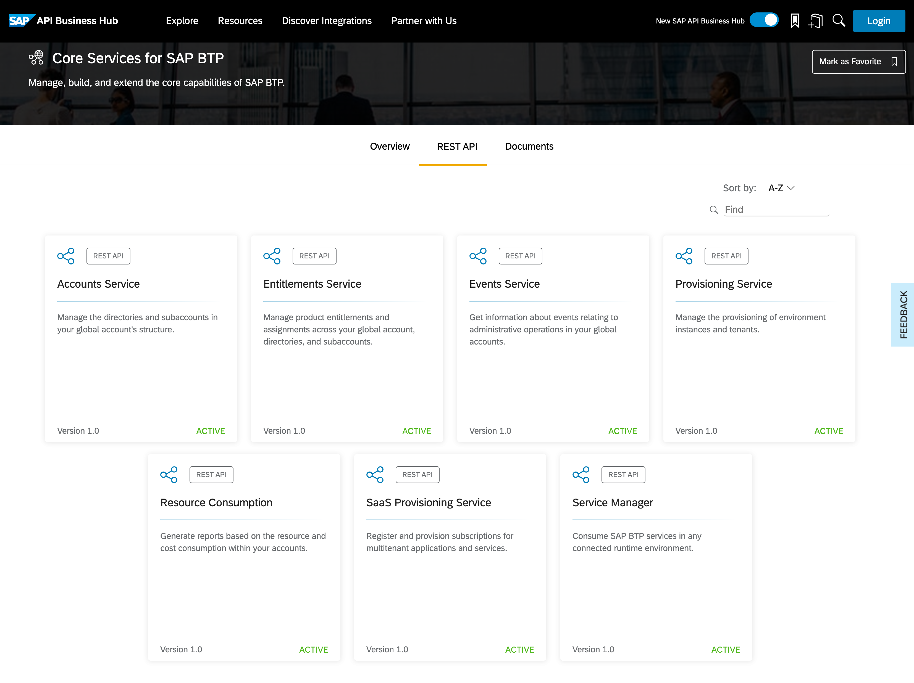
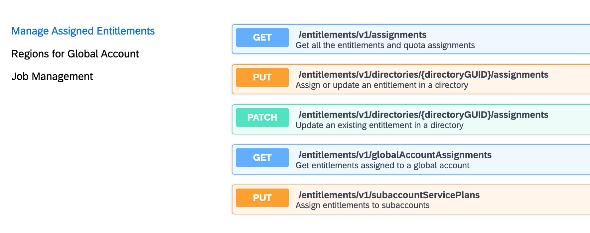
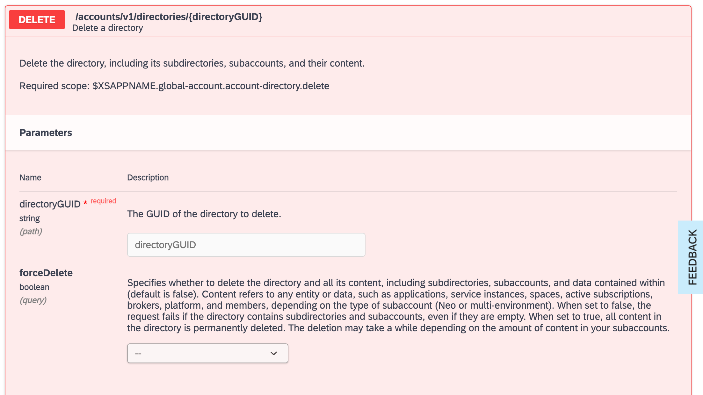

# Exercise 09 - Deleting resources with the API

You've created resources with the btp CLI in the previous exercise, specifically a directory and a subaccount. In this exercise, to layer on a bit more experience and understanding, you're going to remove those resources using the appropriate API.

## Make the necessary preparations

It's worth double-checking what you're going to delete, and to get everything ready for action.

### Identify the directory and subaccount to delete

👉 Have a look at the hierarchy of directories and subaccounts:

```bash
btp get accounts/global-account --show-hierarchy | trunc
```

In the output that ensues, identify the directory and subaccount that you created in the previous exercise. The output should look similar to this, and you can see the parent/child relationship between the two resources (highlighted with arrows):

```text
Showing details for global account fdce9323-d6e6-42e6-8df0-5e501c90a2be...

├─ 8fe7efd4trial (fdce9323-d6e6-42e6-8df0-5e501c90a2be - global account)
│  ├─ trial (f78e0bdb-c97c-4cbc-bb06-526695f44551 - subaccount)
│  ├─ codejam-directory (f4c7d60e-627c-4fab-8e67-603b20b84f72 - directory)          <----
│  │  ├─ codejam-subaccount (be63bfda-070a-49a8-ab26-03153b16617e - subaccount)     <----

type:            id:                                    display name:        parent id:                             parent
global account   fdce9323-d6e6-42e6-8df0-5e501c90a2be   8fe7efd4trial
subaccount       cd76fdef-16f8-47a3-954b-cab6678cc24d   testsubaccount       fdce9323-d6e6-42e6-8df0-5e501c90a2be   global
subaccount       f78e0bdb-c97c-4cbc-bb06-526695f44551   trial                fdce9323-d6e6-42e6-8df0-5e501c90a2be   global
directory        f4c7d60e-627c-4fab-8e67-603b20b84f72   codejam-directory    fdce9323-d6e6-42e6-8df0-5e501c90a2be   global
subaccount       be63bfda-070a-49a8-ab26-03153b16617e   codejam-subaccount   f4c7d60e-627c-4fab-8e67-603b20b84f72   direct
```

👉 Check that you can still use the `btpguid` script (that you created a symbolic link to in your `$HOME/bin/` directory in the previous exercise) to get the GUIDs of these resources:

```bash
btpguid codejam-directory; btpguid codejam-subaccount
```

You should see output similar to this - i.e. the two GUIDs:

```text
f4c7d60e-627c-4fab-8e67-603b20b84f72
be63bfda-070a-49a8-ab26-03153b16617e
```

### Identify the appropriate API endpoint

In a previous exercise, we used the `/entitlements/v1/globalAccountAllowedDataCenters` endpoint of the Entitlements Service API. This time, we need to look at endpoints in the Accounts Service API.



👉 Take a moment to look at the [API reference for the Entitlements Service API](https://api.sap.com/api/APIEntitlementsService/resource), and you'll see that there are three groups of endpoints:

* Manage Assigned Entitlements
* Regions for Global Account
* Job Management



> The Job Management group contains a single generic endpoint that is common to many of the APIs in this package.

The endpoint we used was within the "Regions for Global Account" group.

This time, we need to find an endpoint that supports operations on directories and subaccounts, and in the Core Services APIs overview we can see that the description for the Accounts Service API sounds like what we're looking for: "_Manage the directories and subaccounts in your global account's structure._"

👉 Select the [Accounts Service API](https://api.sap.com/api/APIAccountsService/overview) in the SAP API Business Hub, go to the [API Reference](https://api.sap.com/api/APIAccountsService/resource) section, and take note of the endpoint groups, which are:

* Directory Operations
* Global Account Operations
* Subaccount Operations
* Job Managment

Within the Directory Operations group, you'll see that there's a specific combination of HTTP method and endpoint thus:

```text
DELETE /accounts/v1/directories/{directoryGUID}
```

### Check we have the right access

👉 Take a look at this endpoint, the required scope, and the parameters:



Back in [Exercise 05 - Preparing to call a Core Services API](https://github.com/SAP-samples/cloud-btp-cli-api-codejam/blob/main/exercises/05-core-services-api-prep/README.md), specifically in the section [Understanding what's required for a token request](https://github.com/SAP-samples/cloud-btp-cli-api-codejam/blob/main/exercises/05-core-services-api-prep/README.md#understanding-whats-required-for-a-token-request), we noted that the `central` plan for the SAP Cloud Management service for SAP BTP (`cis`) provided greater access.

👉 Go back to the [SAP Cloud Management - Service Plans](https://help.sap.com/docs/BTP/65de2977205c403bbc107264b8eccf4b/a508b724bf6d457ca7ac024b8e4b8457.html?locale=en-US) and check through the scopes offered with the `central` plan. Make sure you can see that it offers this scope:

```text
global-account.account-directory.delete
```

This is the scope that we see as a requirement to be able to make a DELETE request to this `/accounts/v1/directories/{directoryGUID}` endpoint.

So with our current access token, we should be all set. Right?

Well, yes, but "we should be all set" is a bit vague, don't you think? Let's spend a couple of minutes verifying this.

Back when we [requested the token in Exercise 06](https://github.com/SAP-samples/cloud-btp-cli-api-codejam/blob/main/exercises/06-core-services-api-creds/README.md#request-the-token) we got a whole blob of data, first to the terminal, and then captured into a file `tokendata.json`.

We'll want to take a closer look at this data, so let's make the file available in the directory related to this exercise.

👉 Move to the appropriate directory and create a symbolic link to the file:

```bash
cd $HOME/projects/cloud-btp-cli-api-codejam/exercises/09-deleting-resources-with-api/
ln -s ../06-core-services-api-creds/tokendata.json .
```

👉 Check you can explore the contents from this same directory, like this:

```bash
jq keys tokendata.json
jq .access_token tokendata.json
```

## Further reading

---

If you finish earlier than your fellow participants, you might like to ponder these questions. There isn't always a single correct answer and there are no prizes - they're just to give you something else to think about.
