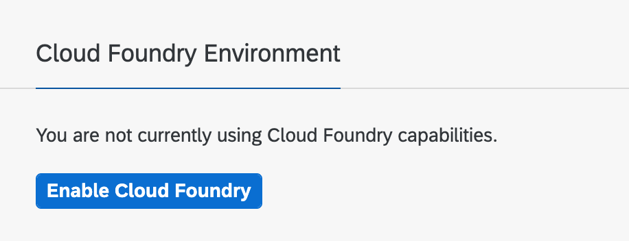
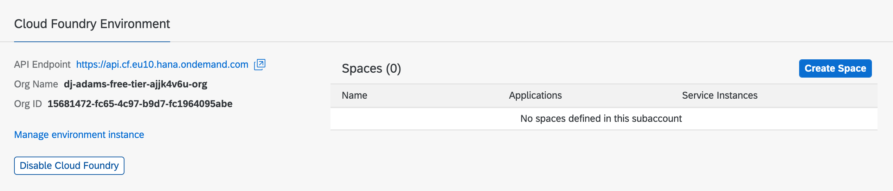
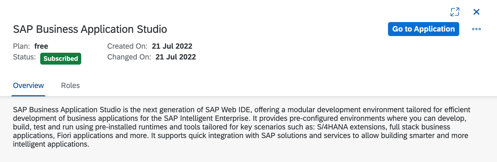

# Prerequisites

These prerequisites are essential to a successful CodeJam. As an attendee, please ensure that you have worked through all of them and set things up before the day of the CodeJam event itself.

## SAP BTP account

You must have an SAP BTP account. If they're still available, an active (unexpired) trial account will be fine. Otherwise you may wish to set up a new global account to take advantage of the Free Tier offerings.

Either way, it's important that you have the Global Account Admin role, which is in the "Global Account Administrator" role collection (see [Role Collections and Roles in Global Accounts, Directories, and Subaccounts [Feature Set B]](https://help.sap.com/docs/BTP/65de2977205c403bbc107264b8eccf4b/0039cf082d3d43eba9200fe15647922a.html?locale=en-US) for more details).

It's also important that the account has [Feature Set B](https://help.sap.com/products/BTP/65de2977205c403bbc107264b8eccf4b/caf4e4e23aef4666ad8f125af393dfb2.html) Cloud Management Tools. You can check this from the BTP Cockpit using the "About" option which will show something like this:

If you don't have an account right now, you can get one by following the instructions in this tutorial: [Get an SAP BTP Account for Tutorials](https://developers.sap.com/tutorials/btp-cockpit-setup.html).

## Subaccount and Cloud Foundry environment

In your account, you must have a subaccount with a Cloud Foundry environment set up. This is an environment that's available in the free tier. Make sure the environment is created and you have an organization and space within it.

If you need to do this, use the Enable Cloud Foundry button in the SAP BTP Cockpit, selecting the "standard" plan (or another free one if it is available):

Then, once the environment is created (it will have asked you for the name of an organization which it will automatically create), use the Create Space button to create a space. If you're stuck for a name, use "dev":

> If you still have a trial account, the subaccount that was set up automatically may already have a Cloud Foundry environment set up already, with an organization and space, and you can use that.

## SAP Business Application Studio

Your account should have a subscription set up to the SAP Business Application Studio (App Studio). If you have a trial account then this subscription may already be set up for you. Otherwise, use the BTP Cockpit to find the entry in the Service Marketplace and create a subscription manually, with the "free" plan (see [Application Plans](https://help.sap.com/products/SAP%20Business%20Application%20Studio/9d1db9835307451daa8c930fbd9ab264/2c72917df87e47c290e061a556d92398.html?locale=en-US) for more info).

You should end up with something that looks like this:

If you see an "Access Denied" message when attempting to access the App Studio, then you are most likely missing some role collection assignments. If this is the case, go to the Security section in the SAP BTP Cockpit and assign the following role collections to your user (remember to sign out and sign back in again for this to take effect):

* Business_Application_Studio_Developer

You may also assign yourself any other App Studio related role collections, but this one is the key role collection that you need.

### A Basic Dev Space set up

Within the App Studio you should set up a "Basic" Dev Space ready for the CodeJam.

When setting this up, please make sure you also select the "MTA Tools" in the "Additional SAP Extensions" list (this will give you the `cf` command line tool, amongst other things).

Give the Dev Space a name, and hit "Create Dev Space".

## Docker Desktop

As an alternative to using a Dev Space in the SAP Business Application Studio, you may wish to follow along in a container instead. This is purely experimental and there is no explicit support for this just yet, but if you want to try it, instead of using a Dev Space, please feel free to do so, and provide any feedback and tips for improvements via the normal route (issue or pull request on this repo).

If you do want to take this experimental route, you'll need a container runtime. While the license for Docker Desktop has changed (see [Docker is Updating and Extending Our Product Subscriptions](https://www.docker.com/blog/updating-product-subscriptions/) for an overview) it's still free for personal use. You may find success with other container runtimes such as Podman, but that's currently beyond the scope of what is offered here.

You'll also need to follow the instructions in the [container/](container/) directory of this repository.

## Knowledge and experience

From a knowledge and experience perspective, the following is useful but not essential:

* Some general experience of working on the command line, or at least an appetite for it
* Some general experience in seeing data in JSON format
* A general idea of the structure of BTP resources such as subaccounts, directories, entitlements, regions and environments
* A general idea of how RESTful APIs are structured and called
* An awareness of shell scripting, using the Bash shell in particular
